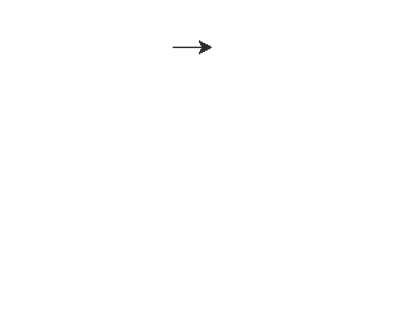

# Python 中的 turtle.clearstamps()方法

> 原文:[https://www . geesforgeks . org/turtle-clear stamps-method-in-python/](https://www.geeksforgeeks.org/turtle-clearstamps-method-in-python/)

海龟模块以面向对象和面向过程的方式提供海龟图形原语。因为它使用 Tkinter 作为底层图形，所以它需要安装一个支持 Tk 的 Python 版本。

## turtle.clearstamps()

turtle.clearstamps()方法用于删除 turtle 的所有或第一个/最后 n 个印章。此方法需要整数参数。所以，制作的 n 枚邮票都被它清除了。

> **语法:**turtle . clear stamps(n =无)
> 
> **可选参数:** n —整数
> 
> *   如果 n 为“无”，则删除 pen 的所有印章，
> *   否则，如果 n > 0，删除前 n 个印记
> *   否则，如果 n < 0，删除最后 n 个戳记。

下面是上述方法的实现，并附有一些例子:

**例 1 :**

## 蟒蛇 3

```py
# import package
import turtle 

# set turtle speed to slowest 
# for better understandings
turtle.speed(1)

# motion with stamps
turtle.forward(50)
turtle.stamp()
turtle.forward(50)
turtle.stamp()
turtle.forward(50)
turtle.stamp()

# hide the turtle to
# clarify stamps
turtle.ht()

# clear the all stamps
turtle.clearstamps()
```

**输出:**


**例 2 :**

## 蟒蛇 3

```py
# import package
import turtle 

# loop to create motion
# with stamps
for i in range(12):

    # motion
    turtle.forward(50)

    # stamp
    turtle.stamp()
    turtle.right(30)

# hide the turtle for 
# better understandings
turtle.ht()

# clear the first 8 stamps
turtle.clearstamps(8)
```

**输出:**

