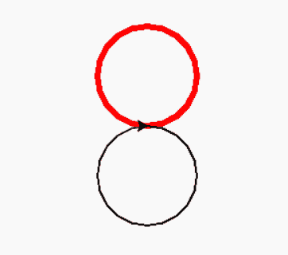
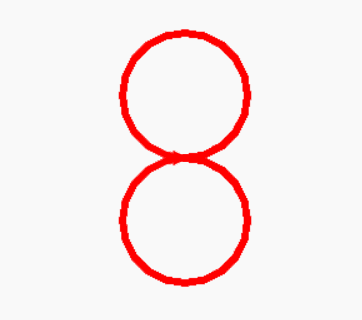

# Python 中的 turtle.clone()函数

> 原文:[https://www . geesforgeks . org/turtle-clone-function-in-python/](https://www.geeksforgeeks.org/turtle-clone-function-in-python/)

海龟模块以面向对象和面向过程的方式提供海龟图形原语。因为它使用 Tkinter 作为底层图形，所以它需要安装一个支持 Tk 的 Python 版本。

## turtle.clone()

方法用于创建和返回具有相同位置、标题和海龟属性的海龟克隆。这个方法不需要任何参数。

**语法:**

```
turtle.clone()

```

下面是上述方法的实现，并以两种方式举例说明，以便更好地理解:

**实施例 1:** 无克隆

## 蟒蛇 3

```
# import package
import turtle

# make first turtle object
tur1=turtle.Turtle()

# set turtle properties
tur1.width(5)
tur1.color("red")

# move it
tur1.circle(50)

# make another turtle object
tur2=turtle.Turtle()

# move it
tur2.circle(-50)
```

**输出:**



**实施例 2:** 克隆

## 蟒蛇 3

```
# import package
import turtle

# make first turtle object
tur1=turtle.Turtle()

# set turtle properties
tur1.width(5)
tur1.color("red")

# move it
tur1.circle(50)

# make another turtle object
tur2=turtle.Turtle()

# cloning the properties of 
# first turtle object
tur2 = tur1.clone()

# move it
tur2.circle(-50)
```

**输出:**



这里我们可以发现，在第一个输出中，第二只海龟(tur2)没有第一只海龟(tur1)的任何属性。为此，我们必须再次设置这些属性。但是，正如我们在第二个输出中看到的，turtle.clone()方法提供了将一个 turtle 对象的属性克隆到另一个的优势。