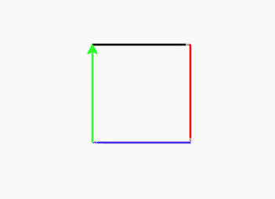

# Python 中的龟. color()方法

> 原文:[https://www . geeksforgeeks . org/turtle-color-in-method-python/](https://www.geeksforgeeks.org/turtle-color-method-in-python/)

海龟模块以面向对象和面向过程的方式提供海龟图形原语。因为它使用 Tkinter 作为底层图形，所以它需要安装一个支持 Tk 的 Python 版本。

## turtle.color()

这个方法是用来改变乌龟的颜色。默认颜色是黑色。

**语法:**

```py
turtle.color(*args)
```

**参数:**

<figure class="table">

| **格式** | **论据** | **描述** |
| --- | --- | --- |
| 海龟色 | 颜色字符串 | 一串颜色名称像“红”、“绿”等。 |
| turtle.color( (r，g，b)) | (r、g、b) | 使用 rgb 颜色代码的三个值 r、g 和 b 的元组 |
| 海龟.颜色(r，g，b) | r、g、b | 使用 rgb 颜色代码的三个值 r、g 和 b |

</figure>

下面是上述方法的实现，并附有一些例子:

**例 1 :**

## 蟒蛇 3

```py
# importing package
import turtle

# use forward by 50 (default = black)
turtle.forward(50)

# change the color of turtle
turtle.color("red")

# use forward by 50 (color = red)
turtle.forward(50)
```

**输出:**


**例 2:**

## 蟒蛇 3

```py
# importing package
import turtle

# use forward by 100 (default = black)
turtle.forward(100)

# change the color of turtle
turtle.color("red")

# use forward by 100 in 90 degrees
# right (color = red)
turtle.right(90)
turtle.forward(100)

# change the color of turtle
turtle.color((41,41,253))

# use forward by 100 in 90 degrees
# right (color = blue)
turtle.right(90)
turtle.forward(100)

# change the color of turtle
turtle.color(41,253,41)

# use forward by 100 in 90 degrees
# right (color = green)
turtle.right(90)
turtle.forward(100)
```

**输出:**

