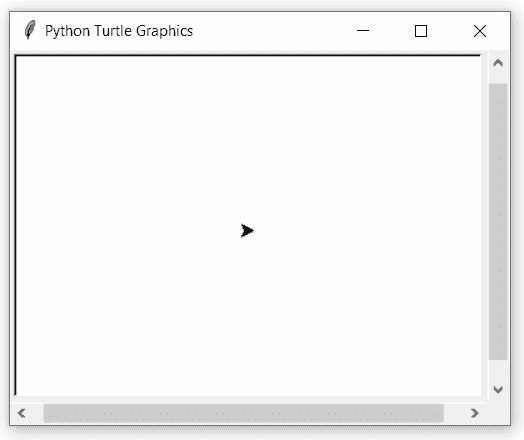

# Python 中的 turtle.degrees()函数

> 原文:[https://www . geesforgeks . org/turtle-degrees-function-in-python/](https://www.geeksforgeeks.org/turtle-degrees-function-in-python/)

海龟模块以面向对象和面向过程的方式提供海龟图形原语。因为它使用 tkinter 作为底层图形，所以需要安装一个支持 Tk 的 Python 版本。

## 海龟.度()

此方法用于将角度测量单位设置为度。默认情况下，角度测量单位是“度”。

> **语法:**龟度(全圆=360.0)
> 
> **参数:**
> 
> **全圆(可选):**一个数字。设定角度测量单位，即设定整圆的“度”数。默认值为 360 度。

下面是上述方法的一个示例实现:

## 蟒蛇 3

```
# importing package
import turtle

# set turtle speed
turtle.speed(1)

# forward turtle by 100
turtle.forward(100)

# turn the turtle (degrees)
turtle.left(90)

# print heading
print(turtle.heading())

# move forward by 100
turtle.forward(100)

# set to radians
turtle.radians()

# turn to left by 90 (radians)
turtle.left(1.57079633)

# print heading
print(turtle.heading())

# move forward by 100
turtle.forward(100)

# set to radians
turtle.degrees()

# turn to left by 90 (degrees)
turtle.left(90)

# print heading
print(turtle.heading())
```

**输出:**

