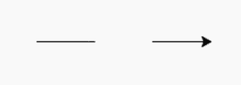
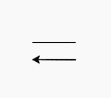

# Python 中的 turtle.down()方法

> 原文:[https://www.geeksforgeeks.org/turtle-down-method-in-python/](https://www.geeksforgeeks.org/turtle-down-method-in-python/)

海龟模块以面向对象和面向过程的方式提供海龟图形原语。因为它使用 Tkinter 作为底层图形，所以它需要安装一个支持 Tk 的 Python 版本。

## turtle.down()

turtle.down()方法用于在屏幕上拉回笔。它给出了移动到另一个位置或方向的绘图。

```
turtle.down() or turtle.pd() or turtle.pendown()

```

这里，这个方法可以用上面写的三个名字来调用，即；它有别名:pendown | pd | down。此方法不需要参数。

下面是上述方法的实现，并附有一些例子:

**例 1:**

## 蟒蛇 3

```
# import package
import turtle

# forward the turtle (drawing)
turtle.forward(50)

# up the turtle
turtle.up()

# forward the turtle (no drawing)
turtle.forward(50)

# down the turtle
turtle.down()

# forward the turtle (drawing)
turtle.forward(50)
```

**输出:**



**例 2:**

## 蟒蛇 3

```
# import package
import turtle

# forward the turtle (drawing)
turtle.forward(50)

# turn right 90 degrees
turtle.right(90)

# up the turtle
turtle.up()

# forward the turtle (no drawing)
turtle.forward(50)

# down the turtle
turtle.down()

# turn right 90 degrees
turtle.right(90)

# forward the turtle (drawing)
turtle.forward(50)
```

**输出:**

