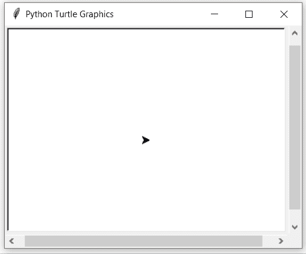

# Python 中的 turtle.end_fill()函数

> 原文:[https://www . geesforgeks . org/turtle-end _ fill-function-in-python/](https://www.geeksforgeeks.org/turtle-end_fill-function-in-python/)

海龟模块以面向对象和面向过程的方式提供海龟图形原语。因为它使用 Tkinter 作为底层图形，所以它需要安装一个支持 Tk 的 Python 版本。

## turtle.end_fill()

此方法用于填充调用 begin_fill()后绘制的形状。这不需要任何争论。

**语法:**

```py
turtle.end_fill()
```

下面是上述方法的一个示例实现:

**示例:**

## 蟒蛇 3

```py
# importing package
import turtle

# set turtle position
# and color
turtle.up()
turtle.goto(0,-30)
turtle.down()
turtle.color("yellow")

# start fill block
turtle.begin_fill()

# all instruction within this
# block are filled with turtle
# color as set above
turtle.circle(60)

# end fill block
turtle.end_fill()

# hide the turtle
turtle.hideturtle()
```

**输出:**

