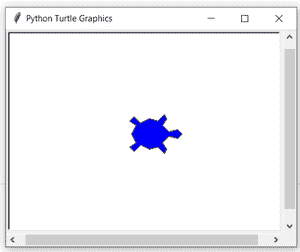
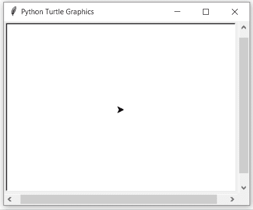

# Python 中的 turtle.fillcolor()函数

> 原文:[https://www . geesforgeks . org/turtle-fill color-function-in-python/](https://www.geeksforgeeks.org/turtle-fillcolor-function-in-python/)

海龟模块以面向对象和面向过程的方式提供海龟图形原语。因为它使用 Tkinter 作为底层图形，所以它需要安装一个支持 Tk 的 Python 版本。

## turtle.fillcolor()

此方法用于返回或设置 fillcolor。如果[高领衫](https://www.geeksforgeeks.org/turtle-shape-function-in-python/)是一个多边形，该多边形的内部用新设置的填充颜色绘制。

> **语法:** turtle.fillcolor(*args)
> 
> #### 参数:
> 
> *   **fillcolor() :** 将当前 fillcolor 作为颜色规格字符串返回，可能是十六进制数字格式。
> *   **fillcolor(colorstring) :** 是 Tk 颜色规格字符串，如“红色”或“黄色”。
> *   **fillcolor((r，g，b)):**r、g 和 b 的元组，表示 RGB 颜色，并且 r、g 和 b 中的每一个都在 0 到 colormode 的范围内
> *   **fillcolor(r，g，b) :** r，g，b 代表一种 RGB 颜色，r，g，b 各在 0 到 colormode 的范围内。

下面是上述方法的实现，并附有一些例子:

**例 1 :**

## 蟒蛇 3

```py
# importing package
import turtle

# set turtle
turtle.shape("turtle")
turtle.turtlesize(3,3,1)

# check by default value
print(turtle.fillcolor())

# set blue color
turtle.fillcolor("blue")

# check fillcolor value
print(turtle.fillcolor())
```

**输出:**



```py
black
blue

```

**例 2 :**

## 蟒蛇 3

```py
# importing package
import turtle

# method to draw a star
def star():
    for i in range(5):
        turtle.forward(60)
        turtle.right(144)

# method to set position
# and fill color in star
def draw(x,y,col):
    turtle.up()
    turtle.setpos(x,y)
    turtle.down()
    turtle.fillcolor(col)
    turtle.begin_fill()
    star()
    turtle.end_fill()

# Driver Code
draw(-100,0,"red")
draw(-50,0,"yellow")
draw(0,0,"blue")
draw(50,0,"green")

# hide the turtle
turtle.hideturtle()
```

**输出:**

