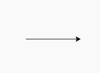
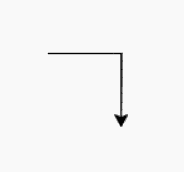

# Python 中的龟. forward()方法-龟

> 原文:[https://www . geesforgeks . org/turtle-forward-method in-python-turtle/](https://www.geeksforgeeks.org/turtle-forward-method-in-python-turtle/)

海龟模块以面向对象和面向过程的方式提供海龟图形原语。因为它使用 Tkinter 作为底层图形，所以它需要安装一个支持 Tk 的 Python 版本。

## 海龟.前进()

turtle.forward()方法用于根据接受的参数值向前移动乌龟。它给出了移动到另一个位置或方向的路线。

```
turtle.forward(distance)

```

它采用的参数是距离{一个数字(整数或浮点数)}。所以，它将乌龟向前移动指定的距离，朝着乌龟前进的方向。

下面是上述方法的实现，并附有一些例子:

**例 1:**

## 蟒蛇 3

```
# importing packages
import turtle

# move turtle forward with 
# distance = 100
turtle.forward(100)
```

**输出:**



**例 2:**

## 蟒蛇 3

```
# importing package
import turtle

# move the turtle forward by 50
turtle.forward(50)

# change the direction
turtle.right(90)

# move the turtle forward by 50 again
turtle.forward(50)
```

**输出:**

