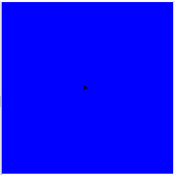

# Python 中的 turtle.getscreen()函数

> 原文:[https://www . geesforgeks . org/turtle-getscreen-function-in-python/](https://www.geeksforgeeks.org/turtle-getscreen-function-in-python/)

海龟模块以面向对象和面向过程的方式提供海龟图形原语。因为它使用 Tkinter 作为底层图形，所以它需要安装一个支持 Tk 的 Python 版本。

## turtle.getscreen()

这个函数用来返回乌龟正在画的乌龟屏幕对象。这不需要任何争论。所以可以为该对象调用 TurtleScreen 方法。

**语法:**

```py
turtle.getscreen()
```

下面是上述方法的实现，并附有一些例子:

**例 1 :**

## 蟒蛇 3

```py
# import package
import turtle

# get turtle screen object
# and store it 
sc=turtle.getscreen()

# print the turtle screen object
print(sc)
```

**输出:**

```py
<__main__.Screen object>

```

**例 2 :**

## 蟒蛇 3

```py
# import package
import turtle

# get turtle screen object
# and store it 
sc=turtle.getscreen()

# use it for turtle screen methods
sc.setup(400,400)
sc.bgcolor("blue")
```

**输出:**

