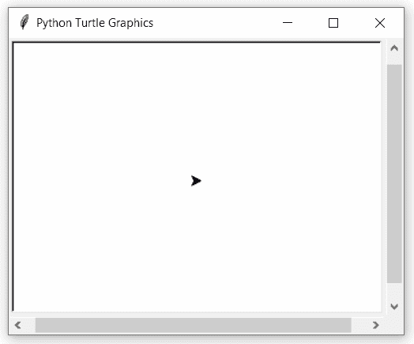

# Python 中的 turtle.heading()函数

> 原文:[https://www . geesforgeks . org/turtle-heading-function-in-python/](https://www.geeksforgeeks.org/turtle-heading-function-in-python/)

海龟模块以面向对象和面向过程的方式提供海龟图形原语。因为它使用 Tkinter 作为底层图形，所以它需要安装一个支持 Tk 的 Python 版本。

## 海龟.航向()

这个函数用来返回海龟当前的航向。这不需要任何争论。

**语法:**

```py
turtle.heading()

```

下面是上述方法的实现，并附有一些例子:

**例 1 :**

## 蟒蛇 3

```py
# import package
import turtle

# default heading value
print(turtle.heading())
```

**输出:**

```py
0.0

```

**例 2 :**

## 蟒蛇 3

```py
# import package
import turtle

# set turtle speed
# for better inderstandings
turtle.speed(1)

# loop for pattern
for i in range(4):
    turtle.forward(100)

    # get heading value
    val = turtle.heading()

    # write it
    turtle.write(str(val))
    turtle.backward(100)
    turtle.left(90)
```

**输出:**

