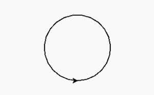

# Python 中的 turtle.hideturtle()函数

> 原文:[https://www . geesforgeks . org/turtle-hide turtle-function-in-python/](https://www.geeksforgeeks.org/turtle-hideturtle-function-in-python/)

海龟模块以面向对象和面向过程的方式提供海龟图形原语。因为它使用 Tkinter 作为底层图形，所以它需要安装一个支持 Tk 的 Python 版本。

## turtle.hideturtle()

这个方法是用来让乌龟隐形的。这是一个好主意，当你在一个复杂的绘图过程中时，因为隐藏海龟会显著加快绘图速度。这个方法不需要任何参数。

**语法:**

```py
turtle.hideturtle() or turtle.ht()

```

下面是上述方法的实现，并附有一些例子:

**例 1 :**

## 蟒蛇 3

```py
# importing package
import turtle

# forward turtle by 100
turtle.forward(100)

# hide the turtle
turtle.hideturtle()
```

**输出:**


**例 2 :**

## 蟒蛇 3

```py
# importing package
import turtle

# draw a circle
turtle.circle(80)

# hide the turtle
turtle.hideturtle()
```

**输出:**



没有藏住乌龟


藏起乌龟