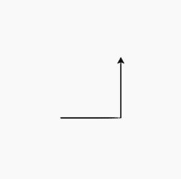
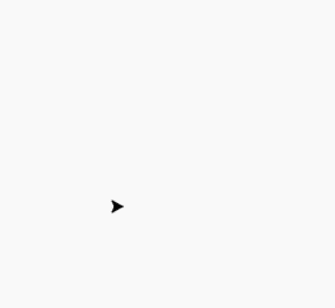

# Python 中的 turtle.left()方法

> 原文:[https://www.geeksforgeeks.org/turtle-left-method-in-python/](https://www.geeksforgeeks.org/turtle-left-method-in-python/)

海龟模块以面向对象和面向过程的方式提供海龟图形原语。因为它使用 Tkinter 作为底层图形，所以它需要安装一个支持 Tk 的 Python 版本。

## turtle.left()

turtle.left()方法用于根据所取参数的值来改变 turtle 的方向。它让乌龟的头朝一个方向移动。

```py
turtle.left(angle)

```

它采用的参数是 angle {一个数字(整数或浮点数)}。所以，它以角度单位把乌龟向左拐。(单位默认为度，但可以通过度()和弧度()函数进行设置。)角度方向取决于模式。

下面是上述方法的实现，并附有一些例子:

**例 1:**

## 蟒蛇 3

```py
# importing package
import turtle

# move the turtle forward by 
# 100 unit distance in the
# direction of head of turtle
turtle.forward(100)

# change the direction of turtle
# by 90 degrees to the left.
turtle.left(90)

# move the turtle forward by 
# 100 unit distance in the 
# direction of head of turtle
turtle.forward(100)
```

**输出:**



**例 2:**

## 蟒蛇 3

```py
# importing package
import turtle

# Loop for pattern
for i in range(10):

  # move the turtle forward by 
  # 100+variable unit distance
  # in the direction of head of
  # turtle
  turtle.forward(100+10*i)

  # change the direction of turtle
  # by 90 degrees to the left.
  turtle.left(90)
```

**输出:**

