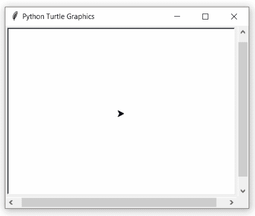

# Python 中的 turtle.mode()函数

> 原文:[https://www . geesforgeks . org/turtle-mode-function-in-python/](https://www.geeksforgeeks.org/turtle-mode-function-in-python/)

海龟模块以面向对象和面向过程的方式提供海龟图形原语。因为它使用 Tkinter 作为底层图形，所以它需要安装一个支持 Tk 的 Python 版本。

## turtle.mode()

该功能用于设置海龟模式(“标准”、“徽标”或“世界”)并执行重置。

> **语法:**海龟.模式(模式=无)
> 
> **参数:**
> 
> **模式:**字符串“标准”、“标志”或“世界”之一
> 
> *   模式'标准'与 turtle.py 兼容。
> *   模式“徽标”与大多数徽标-乌龟-图形兼容。
> *   模式“世界”使用用户定义的“世界坐标”。

下面是上述方法的实现，并附有一些例子:

**例 1 :**

## 蟒蛇 3

```py
# importing package
import turtle

# check by default value
print(turtle.mode())
```

**输出:**

```py
standard

```

**例 2 :**

## 蟒蛇 3

```py
# importing package
import turtle

# motion with default mode (standard)
# default direction of turtle head 
# is north in standard mode
turtle.forward(180)

# set mode to 'logo' mode
turtle.mode(mode='logo')

# do some motion
# default direction of turtle head 
# is east in logo mode
turtle.forward(120)

# set mode to 'world' mode
turtle.mode(mode='world')

# do some motion
turtle.forward(100)

# set coordinates of the turtle 
# mode (world) by choice of user
turtle.setworldcoordinates(-500,-500,500,500)
```

**输出:**

