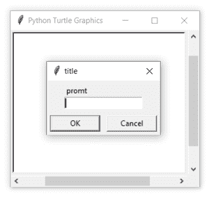
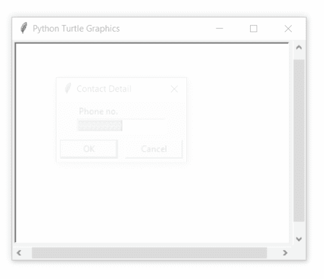

# Python 中的 turtle.numinput()函数

> 原文:[https://www . geesforgeks . org/turtle-numinput-function-in-python/](https://www.geeksforgeeks.org/turtle-numinput-function-in-python/)

海龟模块以面向对象和面向过程的方式提供海龟图形原语。因为它使用 Tkinter 作为底层图形，所以它需要安装一个支持 Tk 的 Python 版本。

## 海龟. numinput()

该功能用于弹出一个输入数字的对话框。如果给定，数字输入必须在 minval 到 maxval 的范围内。如果没有，则发出提示，并且对话框保持打开以进行更正。

**语法:**

> turtle.numinput(标题，提示，默认值=无，minval =无，maxval =无)

**参数:**

<figure class="table">

| **论据** | **描述** |
| 标题 | 对话窗口的标题 |
| 提示 | ext 主要描述输入什么数字信息 |
| 系统默认值 | 缺省值 |
| 我吗 | 输入的最小值 |
| 和麦克斯一起 | 输入的最大值 |

</figure>

下面是上述方法的实现，并附有一些例子:

**例 1 :**

## 蟒蛇 3

```
# import package
import turtle
turtle.numinput("title","prompt")
```

**输出:**



**例 2 :**

## 蟒蛇 3

```
# import package
import turtle

# taking input
num = int(turtle.numinput("Contact Detail",
                          "Phone no.",
                          default=9999999999,
                          minval=6000000000,
                          maxval=9999999999
                          ))
print(num)
```

**输出:**



```
9897347846
```