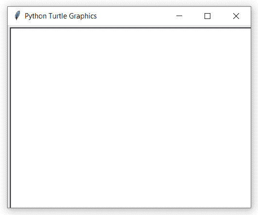

# Python 中的 turtle.ondrag()函数

> 原文:[https://www . geesforgeks . org/turtle-ondrag-function-in-python/](https://www.geeksforgeeks.org/turtle-ondrag-function-in-python/)

海龟模块以面向对象和面向过程的方式提供海龟图形原语。因为它使用 tkinter 作为底层图形，所以需要安装一个支持 Tk 的 Python 版本。

## turtle.ondrag()

这个功能是用来绑定有趣的鼠标移动事件在这个画布上的海龟。

> **语法:** turtle.ondrag(fun，btn，add)
> T3】参数:
> 
> *   **趣味:**一个有两个参数的函数，被点击的点在画布上的坐标将被分配给这个函数
> *   **btn :** 鼠标按钮的数量默认为 1(鼠标左键)
> *   **加:**真或假。如果为真，将添加新绑定，否则将替换以前的绑定

下面是上述方法的一个示例实现:

**示例:**

```
# importing package
import turtle

# method to call on drag
def fxn(x, y):

    # stop backtracking
    turtle.ondrag(None) 

    # move the turtle's angle and direction 
    # towards x and y
    turtle.setheading(turtle.towards(x, y))

    # go to x, y
    turtle.goto(x, y)

    # call again
    turtle.ondrag(fxn)

# set turtle speed
turtle.speed(10)

# make turtle screen object
sc = turtle.Screen()

# set screen size
sc.setup(400, 300)

# call fxn on drag
turtle.ondrag(fxn)

# take screen in mainloop
sc.mainloop()
```

**输出:**
