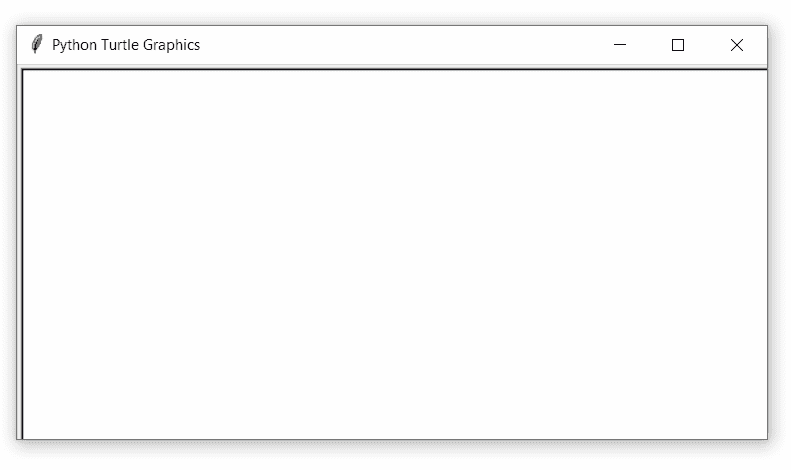
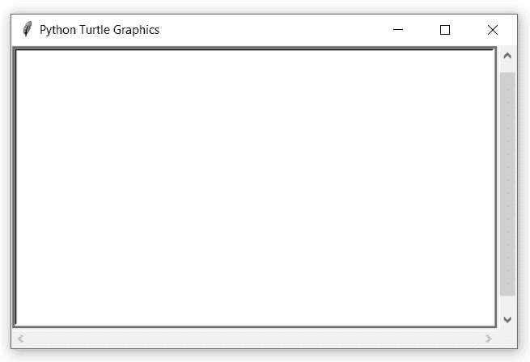

# Python 中的 turtle.onkey()函数

> 原文:[https://www . geesforgeks . org/turtle-onkey-function-in-python/](https://www.geeksforgeeks.org/turtle-onkey-function-in-python/)

海龟模块以面向对象和面向过程的方式提供海龟图形原语。因为它使用 Tkinter 作为底层图形，所以它需要安装一个支持 Tk 的 Python 版本。

## turtle.onkey()

该函数用于将乐趣绑定到按键的按键释放事件。为了能够注册按键事件，TurtleScreen 必须有焦点。

**语法:**

```
turtle.onkey(fun, key)

```

**参数:**

<figure class="table">

| **论据** | **描述** |
| 乐趣 | 没有参数的函数 |
| 键 | 字符串:键(如“a”)或键符号(如“空格”) |

</figure>

下面是上述方法的实现，并附有一些例子:

**例 1 :**

## 蟒蛇 3

```
# import package
import turtle

# method for key call
def fxn():
    turtle.forward(40)

# set turtle screen size
sc=turtle.Screen()
sc.setup(600,300)

# motion
turtle.forward(40)

# call method on Right key
turtle.onkey(fxn,'Right')

# to listen by the turtle
turtle.listen()
```

**输出:**



**例 2 :**

## 蟒蛇 3

```
# import package
import turtle

# methods with different work 
# at different keys
def fxn():
    turtle.forward(20)

def fxn1():
    turtle.right(90)

def fxn2():
    turtle.left(90)

# set screen size
sc=turtle.Screen()
sc.setup(500,300)

# call methods
turtle.onkey(fxn,'space')
turtle.onkey(fxn1,'Right')
turtle.onkey(fxn2,'Left')

# to listen by the turtle
turtle.listen()
```

**输出:**

