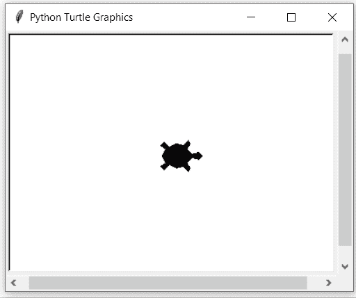

# Python 中的 turtle.onrelease()函数

> 原文:[https://www . geesforgeks . org/turtle-on release-function-in-python/](https://www.geeksforgeeks.org/turtle-onrelease-function-in-python/)

海龟模块以面向对象和面向过程的方式提供海龟图形原语。因为它使用 tkinter 作为底层图形，所以需要安装一个支持 Tk 的 Python 版本。

## turtle.onrelease()

这个函数是用来把乐趣绑定到画布上这只乌龟的鼠标按钮释放事件上的。

**语法:**

```
turtle.onrelease(fun, btn=1, add=None)

```

**参数:**

<figure class="table">

| **论据** | **描述** |
| 乐趣 | 一个有两个参数的函数，画布上被点击的点的坐标将被分配给这个函数。 |
| btn | 鼠标按钮的数量默认为 1(鼠标左键)。 |
| 增加 | 真或假。如果为真，将添加新绑定，否则，它将替换以前的绑定 |

</figure>

下面是上述方法的一个示例实现:

## 蟒蛇 3

```
# import package
import turtle

# methods to action
def fxn1(x,y):
   turtle.fillcolor("blue")
def fxn2(x,y):
   turtle.fillcolor("white")

# set screen and turtle
sc=turtle.Screen()
sc.setup(400,300)

turtle.shape("turtle")
turtle.turtlesize(2)
turtle.speed(1)

# allow user to click for some action
turtle.onclick(fxn1)

# allow user to release for some action
turtle.onrelease(fxn2)
```

**输出:**



这里我们可以发现:

*   每当用户点击海龟时(箭头上的黄色点),海龟就会变成蓝色
*   从屏幕上释放(黄点消失)后，它会变成白色。