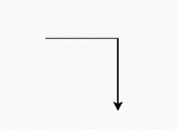
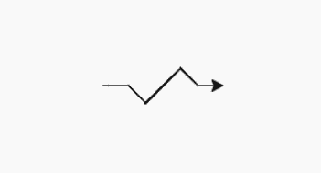

# Python 中的 turtle.pos()方法

> 原文:[https://www.geeksforgeeks.org/turtle-pos-method-in-python/](https://www.geeksforgeeks.org/turtle-pos-method-in-python/)

[海龟](https://www.geeksforgeeks.org/turtle-programming-python/)模块以面向对象和面向过程的方式提供海龟图形原语。因为它使用 Tkinter 作为底层图形，所以它需要安装一个支持 Tk 的 Python 版本。

## turtle.pos()

这种方法用于找到海龟的当前位置(x，y)，作为 Vec2D 向量。此方法具有别名:位置。

> **语法:** turtle.pos()或 turtle.position()
> 
> **返回:**乌龟在(x，y)坐标上的当前位置

该函数不需要任何参数，以(x，y)格式返回海龟的当前位置，其中 x 和 y 表示 2D 向量。默认值为(0.0，0.0)。

下面是上述方法的实现，并附有一些例子:

**例 1 :**

## 蟒蛇 3

```py
# import turtle package
import turtle 

# print the default 
# position i.e; (0.0, 0.0)
print(turtle.pos())

# forward turtle by 150 pixels
turtle.forward(150)

# print current position 
# i.e; (150.0, 0.0)
print(turtle.pos())

# forward turtle by 150 pixels
# after taking turn right
# by 90 degrees
turtle.right(90)
turtle.forward(150)

# print position (after next move)
# i.e; (150.0, -150.0)
print(turtle.pos())
```

**输出:**



```py
(0.0, 0.0)
(150.0, 0.0)
(150.0, -150.0)

```

**例 2:**

## 蟒蛇 3

```py
# import turtle package
import turtle 

# print position (by default)
# i.e; (0.0, 0.0)
print(turtle.pos())

# turtle move forward 
# by 40 pixels
turtle.forward(40)

# print position (after move)
# i.e; (150.0, 0.0)
print(turtle.position())

# turtle move forward by 40 pixels
# after taking right turn 
# by 45 degrees
turtle.right(45)
turtle.forward(40)

# print position
# (after next move) 
print(turtle.pos())

# turtle move forward by 80 
# pixels after taking left
# turn by 90 degrees
turtle.left(90)
turtle.forward(80)

# print position
# (after next move) 
print(turtle.pos())

# turtle move forward 
# by 40 pixels after taking 
# right turn by 90 degrees
turtle.right(90)
turtle.forward(40)

# print position (after next move) 
print(turtle.position())

# turtle move forward by 
# 40 pixels after taking 
# left turn by 45 degrees
turtle.left(45)
turtle.forward(40)

# print position 
# (after final move) 
print(turtle.pos())
```

**输出:**



```py
(0.0, 0.0)
(40.0, 0.0)
(68.2842712475, -28.2842712475)
(124.852813742, 28.2842712475)
(153.13708499, 0.0)
(193.13708499, 0.0)

```