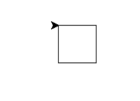
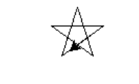
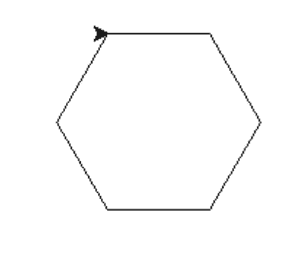

# Python 中的海龟编程

> 原文:[https://www.geeksforgeeks.org/turtle-programming-python/](https://www.geeksforgeeks.org/turtle-programming-python/)

“乌龟”是一个类似画板的 Python 特性，让我们命令一只乌龟在上面画来画去！我们可以使用像 turtle.forward(…)和 turtle.right(…)这样的函数来移动乌龟。常用的养龟方法有:

<figure class="table">

| 方法 | 参数 | 描述 |
| --- | --- | --- |
| 乌龟() | 没有人 | 创建并返回一个新的海龟对象 |
| 向前() | 数量 | 将海龟向前移动指定的量 |
| 向后() | 数量 | 将海龟向后移动指定的量 |
| 右() | 角 | 顺时针转动乌龟 |
| 左() | 角 | 逆时针转动乌龟 |
| penup() | 没有人 | 拿起乌龟的笔 |
| pendown() | 没有人 | 放下乌龟的笔 |
| 向上() | 没有人 | 拿起乌龟的笔 |
| 向下() | 没有人 | 放下乌龟的笔 |
| 颜色() | 颜色名称 | 改变乌龟笔的颜色 |
| 填充颜色（） | 颜色名称 | 改变乌龟用来填充多边形的颜色 |
| 标题() | 没有人 | 返回当前标题 |
| 位置() | 没有人 | 返回当前位置 |
| goto() | x，y | 将海龟移动到 x，y 位置 |
| begin_fill() | 没有人 | 记住填充多边形的起点 |
| end_fill() | 没有人 | 关闭多边形并用当前填充颜色填充 |
| 点() | 没有人 | 将点留在当前位置 |
| 邮票() | 没有人 | 在当前位置留下龟形的印象 |
| 形状() | 共享名 | 应该是‘箭’、‘经典’、‘龟’或者‘圆’ |

</figure>

**使用海龟绘图**

为了利用海龟的方法和功能，我们需要引进海龟。“海龟”自带标准 Python 包，无需外部安装。执行海龟计划的路线图遵循 4 个步骤:

1.  导入海龟模块
2.  创造一只乌龟来控制。
3.  用海龟的方法画画。
4.  运行海龟. done()。

所以如上所述，在我们可以使用海龟之前，我们需要导入它。我们将其导入为:

```py
from turtle import *
# or
import turtle
```

在导入海龟库并使所有海龟功能对我们可用后，我们需要创建一个新的画板(窗口)和一只海龟。让我们称窗户为 wn，乌龟为 skk。所以我们编码为:

```py
wn = turtle.Screen()
wn.bgcolor("light green")
wn.title("Turtle")
skk = turtle.Turtle()
```

现在我们已经创建了窗口和乌龟，我们需要移动乌龟。为了在 skk 面对的方向上向前移动 100 个像素，我们编码:

```py
skk.forward(100)
```

我们已经向前移动了 skk 100 像素，太棒了！现在我们用 done()函数完成程序，我们完成了！

```py
turtle.done()
```

因此，我们创建了一个程序，绘制一条 100 像素长的线。我们可以用海龟的方法画各种形状，填充不同的颜色。有太多的函数和程序需要使用 python 中的海龟库进行编码。让我们学习画一些基本的形状。

**形状 1:方形**

## 计算机编程语言

```py
# Python program to draw square
# using Turtle Programming
import turtle
skk = turtle.Turtle()

for i in range(4):
    skk.forward(50)
    skk.right(90)

turtle.done()
```

**输出:**



**形状 2:星**

## 蟒蛇 3

```py
# Python program to draw star
# using Turtle Programming
import turtle
star = turtle.Turtle()

star.right(75)
star.forward(100)

for i in range(4):
    star.right(144)
    star.forward(100)

turtle.done()
```

**输出:**



**形状 3:六边形**

## 计算机编程语言

```py
# Python program to draw hexagon
# using Turtle Programming
import turtle
polygon = turtle.Turtle()

num_sides = 6
side_length = 70
angle = 360.0 / num_sides

for i in range(num_sides):
    polygon.forward(side_length)
    polygon.right(angle)

turtle.done()
```

**输出:**



参观[pythonturtle.org](http://pythonturtle.org/)无需预装 python 即可体验海龟。PythonTurtle 中的外壳是一个完整的 Python 外壳，使用标准 Python 外壳几乎可以做任何事情。你可以做循环，定义函数，创建类等等。
你可以在这里获取这些精彩海龟程序的代码[T5】](https://github.com/SKKSaikia/GeeksforGeeks/blob/master/intern/Turtle_gfg.txt)

### **一些神奇的海龟程序**

**1。螺旋方形外进内出**

## 计算机编程语言

```py
# Python program to draw
# Spiral Square Outside In and Inside Out
# using Turtle Programming
import turtle   #Outside_In
wn = turtle.Screen()
wn.bgcolor("light green")
wn.title("Turtle")
skk = turtle.Turtle()
skk.color("blue")

def sqrfunc(size):
    for i in range(4):
        skk.fd(size)
        skk.left(90)
        size = size-5

sqrfunc(146)
sqrfunc(126)
sqrfunc(106)
sqrfunc(86)
sqrfunc(66)
sqrfunc(46)
sqrfunc(26)
```

## 计算机编程语言

```py
import turtle  #Inside_Out
wn = turtle.Screen()
wn.bgcolor("light green")
skk = turtle.Turtle()
skk.color("blue")

def sqrfunc(size):
    for i in range(4):
        skk.fd(size)
        skk.left(90)
        size = size + 5

sqrfunc(6)
sqrfunc(26)
sqrfunc(46)
sqrfunc(66)
sqrfunc(86)
sqrfunc(106)
sqrfunc(126)
sqrfunc(146)
```

**输出:**

https://www.youtube.com/watch?v=QPf

**2。用户输入模式**

## 计算机编程语言

```py
# Python program to user input pattern
# using Turtle Programming
import turtle   #Outside_In
import turtle
import time
import random

print ("This program draws shapes based on the number you enter in a uniform pattern.")
num_str = input("Enter the side number of the shape you want to draw: ")
if num_str.isdigit():
    squares = int(num_str)

angle = 180 - 180*(squares-2)/squares

turtle.up

x = 0
y = 0
turtle.setpos(x, y)

numshapes = 8
for x in range(numshapes):
    turtle.color(random.random(), random.random(), random.random())
    x += 5
    y += 5
    turtle.forward(x)
    turtle.left(y)
    for i in range(squares):
        turtle.begin_fill()
        turtle.down()
        turtle.forward(40)
        turtle.left(angle)
        turtle.forward(40)
        print (turtle.pos())
        turtle.up()
        turtle.end_fill()

time.sleep(11)
turtle.bye()
```

**3。螺旋螺旋线图案**

## 计算机编程语言

```py
# Python program to draw
# Spiral  Helix Pattern
# using Turtle Programming

import turtle
loadWindow = turtle.Screen()
turtle.speed(2)

for i in range(100):
    turtle.circle(5*i)
    turtle.circle(-5*i)
    turtle.left(i)

turtle.exitonclick()
```

**输出:**

**4。彩虹苯**

## 计算机编程语言

```py
# Python program to draw
# Rainbow Benzene
# using Turtle Programming
import turtle
colors = ['red', 'purple', 'blue', 'green', 'orange', 'yellow']
t = turtle.Pen()
turtle.bgcolor('black')
for x in range(360):
    t.pencolor(colors[x%6])
    t.width(x//100 + 1)
    t.forward(x)
    t.left(59)
```

**输出:**


**使用海龟编程的树木**

**参考文献:**

*   Python 的海龟文档 [3](https://docs.python.org/3.2/library/turtle.html) 和 [2](https://docs.python.org/2/library/turtle.html)
*   [eecs.wsu.edu [PDF]](http://www.eecs.wsu.edu/~schneidj/PyBook/chap13.pdf) ！

本文由 **Amartya Ranjan Saikia** 供稿。如果你喜欢 GeeksforGeeks 并想投稿，你也可以使用[contribute.geeksforgeeks.org](http://www.contribute.geeksforgeeks.org)写一篇文章或者把你的文章邮寄到 contribute@geeksforgeeks.org。看到你的文章出现在极客博客主页上，帮助其他极客。
如果你发现任何不正确的地方，或者你想分享更多关于上面讨论的话题的信息，请写评论。