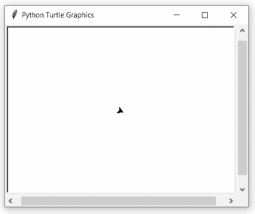

# Python 中的 turtle.register_shape()函数

> 原文:[https://www . geesforgeks . org/turtle-register _ shape-function-in-python/](https://www.geeksforgeeks.org/turtle-register_shape-function-in-python/)

海龟模块以面向对象和面向过程的方式提供海龟图形原语。因为它使用 tkinter 作为底层图形，所以需要安装一个支持 Tk 的 Python 版本。

## turtle.register_shape()

该功能用于在 [TurtleScreen 的形状列表中添加一个乌龟形状。](https://www.geeksforgeeks.org/turtle-getshapes-function-in-python/)

**语法:**

```py
turtle.register_shape(name, shape=None)

```

**参数:**

<figure class="table">

| **论据** | **描述** |
| 名字 | 线 |
| 形状 | 坐标对元组 |

</figure>

下面是上述方法的一个示例实现:

## 蟒蛇 3

```py
# import package
import turtle

# record a polygon
turtle.begin_poly()

# form a polygon
turtle.seth(-45)
turtle.circle(20, 90)
turtle.circle(10, 90)
turtle.circle(20, 90)
turtle.circle(10, 90)

turtle.end_poly()

# get polygon
pairs = turtle.get_poly()

# register shape with
# name : new_shape
# polygon : pairs
turtle.register_shape("new_shape", pairs)

# clear screen
turtle.clearscreen()

# use new shape and
# apply properties
turtle.shape("new_shape")
turtle.fillcolor("blue")

# do some motion
for i in range(50):
    turtle.forward(5+2*i)
    turtle.right(45)
```

**输出:**

