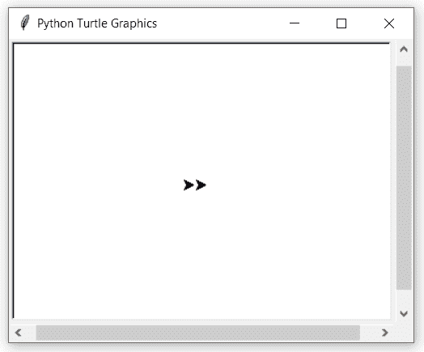

# Python 中的 turtle.reset()函数

> 原文:[https://www . geesforgeks . org/turtle-reset-function-in-python/](https://www.geeksforgeeks.org/turtle-reset-function-in-python/)

海龟模块以面向对象和面向过程的方式提供海龟图形原语。因为它使用 Tkinter 作为底层图形，所以它需要安装一个支持 Tk 的 Python 版本。

## 海龟. reset()

此功能用于删除海龟的图纸并恢复其默认值。这不需要任何争论。

**语法:**

```py
turtle.reset()

```

下面是上述方法的实现，并附有一些例子:

**例 1 :**

## 蟒蛇 3

```py
# import package
import turtle

# motion
for i in range(20):
    turtle.forward(2+2*i)
    turtle.left(45)

# reset the work
turtle.reset()
```

**输出:**


**例 2 :**

## 蟒蛇 3

```py
# import package
import turtle

# make turtle objects
# and set position
t1 = turtle.Turtle()
t2 = turtle.Turtle()
t1.up()
t1.setpos(-70, 0)
t1.down()
t2.up()
t2.setpos(70, 0)
t2.down()

# loop for pattern
for i in range(20):
    t1.forward(2+2*i)
    t1.left(45)
    t2.forward(2+2*i)
    t2.left(90)

# reset first turtle
# another remain as it is
t1.reset()
```

**输出:**

