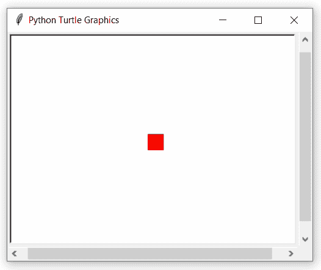

# 甲鱼。屏幕()。Python 中的海龟()函数

> 原文:[https://www . geesforgeks . org/海龟-屏幕-海龟-python 中的函数/](https://www.geeksforgeeks.org/turtle-screen-turtles-function-in-python/)

海龟模块以面向对象和面向过程的方式提供海龟图形原语。因为它使用 Tkinter 作为底层图形，所以它需要安装一个支持 Tk 的 Python 版本。

## 乌龟。屏幕()。海龟()

该功能用于返回屏幕上的海龟列表。这不需要任何争论。

**语法:**

```py
turtle.Screen().turtles()
```

下面是上述方法的实现，并附有一些例子:

**例 1 :**

## 蟒蛇 3

```py
# import package
import turtle

# make screen object
# and set size
sc = turtle.Screen()
sc.setup(400,300)

# make turtle object
t1=turtle.Turtle(shape='square')

# do some motion with properties
t1.color("red")
t1.circle(50)

# make another turtle object
t2=turtle.Turtle(shape='circle')

# do some motion with properties
t2.color("green")
t2.circle(40)

# get all turtle objects on screen
print(sc.turtles())
```

**输出:**


> 【<turtle.turtle object="" at="">、<turtle.turtle object="" at="">】</turtle.turtle></turtle.turtle>

**例 2 :**

## 蟒蛇 3

```py
# import package
import turtle

# make screen object and set size
sc = turtle.Screen()
sc.setup(400, 300)

# make first turtle and do something
t1 = turtle.Turtle(shape='square')
t1.color("red")
t1.circle(50)

# make another turtle and do something
t2 = turtle.Turtle(shape='circle')
t2.color("green")
t2.circle(40)

# get all turtles object
turt = sc.turtles()

# use first turtle object
turt[0].circle(-40)

# use another turtle object
turt[1].circle(-50)
```

**输出:**

