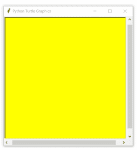
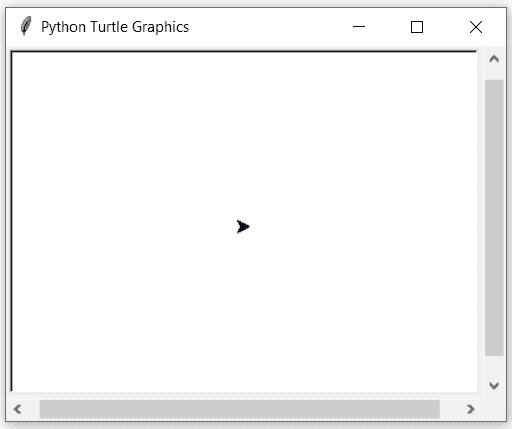

# Python 中的 turtle.screensize()函数

> 原文:[https://www . geesforgeks . org/turtle-screensize-function-in-python/](https://www.geeksforgeeks.org/turtle-screensize-function-in-python/)

海龟模块以面向对象和面向过程的方式提供海龟图形原语。因为它使用 Tkinter 作为底层图形，所以它需要安装一个支持 Tk 的 Python 版本。

## turtle.screensize()

这个方法是用来调整海龟所画画布的大小。如果没有给定参数，这个函数返回当前值(canvaswidth，canvasheight)。

**语法:**

```py
turtle.screensize(canvwidth=None, canvheight=None, bg=None)

```

**参数:**

<figure class="table">

| **论据** | **值** | **描述** |
| canvwidth | 正整数 | 以像素为单位的新画布宽度 |
| can vh8 | 正整数 | 以像素为单位的新画布高度 |
| 锥齿轮 | 颜色串或颜色元组 | 新背景颜色 |

</figure>

下面是上述方法的实现，并附有一些例子:

**例 1 :**

## 蟒蛇 3

```py
# import package
import turtle

# check the screensize by default
# it varies ide to ide
print(turtle.screensize())
```

**输出:**

```py
(400, 300)

```

**例 2 :**

## 蟒蛇 3

```py
# import package
import turtle

# set screen
turtle.screensize(canvwidth=400, canvheight=400,
                  bg="yellow")
```

**输出:**



**例 3 :**

## 蟒蛇 3

```py
# import package
import turtle

# set turtle
turtle.width(2)
turtle.speed(10)

# loop for pattern
for i in range(10):
    turtle.circle(40)
    turtle.right(36)

# set screen and drawing remain as it is.
turtle.screensize(canvwidth=400, canvheight=300,
                  bg="blue")
```

**输出:**

