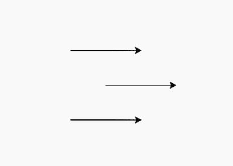
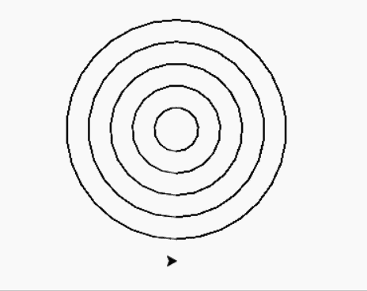

# Python 中的 turtle.setpos()和 turtle.goto()函数

> 原文:[https://www . geesforgeks . org/turtle-set pos-and-turtle-goto-functions-in-python/](https://www.geeksforgeeks.org/turtle-setpos-and-turtle-goto-functions-in-python/)

海龟模块以面向对象和面向过程的方式提供海龟图形原语。因为它使用 Tkinter 作为底层图形，所以它需要安装一个支持 Tk 的 Python 版本。

## turtle.setpos（）

这种方法用于将海龟移动到绝对位置。这个方法有别名:setpos，setposition，goto。

> **语法:** turtle.setpos(x，y =无)或 turtle.setposition(x，y =无)或 turtle.goto(x，y =无)
> 
> **参数:**
> 
> **x:**Vec2d 向量的 x 坐标
> 
> **y:**Vec2d 向量的 y 坐标

下面是上述方法的实现，并附有一些例子:

**例 1:**

## 蟒蛇 3

```py
# import package
import turtle 

# forward turtle by 100
turtle.forward(100)

# stamp the turtle shape
turtle.stamp()

# set the position by using setpos()
turtle.up()
turtle.setpos(-50,50)
turtle.down()

# forward turtle by 100
turtle.forward(100)

# stamp the turtle shape
turtle.stamp()

# set the position by using goto()
turtle.up()
turtle.goto(-50,-50)
turtle.down()

# forward turtle by 100
turtle.forward(100)
```

**输出:**



**例 2 :**

## 蟒蛇 3

```py
# import package
import turtle 

# method to raw pattern
# of circle with rad radius
def draw(rad):

    # draw circle
    turtle.circle(rad)

    # set the position by using setpos()
    turtle.up()
    turtle.setpos(0,-rad)
    turtle.down()

# loop for pattern
for i in range(5):
    draw(20+20*i)
```

**输出:**

