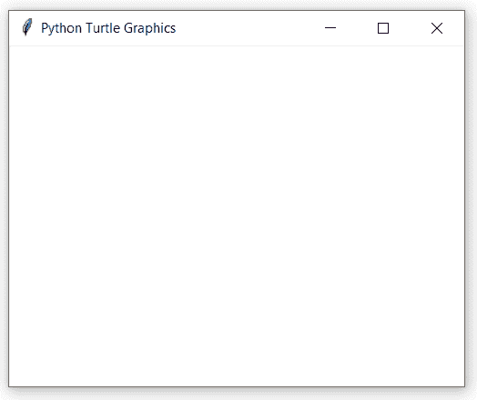

# Python 中的 turtle.setworldcoordinates()函数

> 原文:[https://www . geesforgeks . org/turtle-setworldcoords-function-in-python/](https://www.geeksforgeeks.org/turtle-setworldcoordinates-function-in-python/)

海龟模块以面向对象和面向过程的方式提供海龟图形原语。因为它使用 tkinter 作为底层图形，所以需要安装一个支持 Tk 的 Python 版本。

## turtle.setworldcoordinates()

此功能用于设置用户定义的坐标系。这将执行复位。如果“世界”模式已经激活，所有绘图将根据新坐标重新绘制。

**注意:**在用户定义的坐标系中，角度可能会出现扭曲。

> **语法:**turtle . setworldcoords(llx，ly，urx，ury)
> 
> **参数:**
> 
> *   **llx:** 一个数字，画布左下角的 x 坐标
> *   **ly:**一个数字，画布左下角的 y 坐标
> *   **urx:** 一个数字，画布右上角的 x 坐标
> *   **ury:** 一个数字，画布右上角的 y 坐标

下面是上述方法的实现，并附有一些例子:

**例 1 :**

## 蟒蛇 3

```py
# importing package
import turtle

# make screen object and
# set screen mode to world
sc = turtle.Screen()
sc.mode('world')

# set world coordinates
turtle.setworldcoordinates(-20, -20, 20, 20)

# loop for some motion
for i in range(20):
    turtle.forward(1+1*i)
    turtle.right(90)
```

**输出:**



**甲部**

**例 2:**

## 蟒蛇 3

```py
# importing package
import turtle

# make screen object and
# set screen mode to world
sc = turtle.Screen()
sc.mode('world')

# set world coordinates
turtle.setworldcoordinates(-40, -40, 40, 40)

# loop for some motion
for i in range(20):
    turtle.forward(1+1*i)
    turtle.right(90)
```