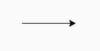
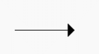
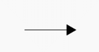
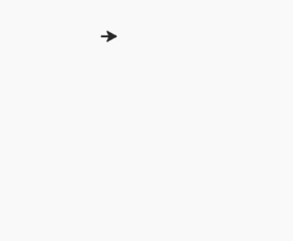

# Python 中的龟形()函数

> 原文:[https://www . geesforgeks . org/turtle-shape-function-in-python/](https://www.geeksforgeeks.org/turtle-shape-function-in-python/)

海龟模块以面向对象和面向过程的方式提供海龟图形原语。因为它使用 tkinter 作为底层图形，所以需要安装一个支持 Tk 的 Python 版本。

## turtle.shape()

此函数用于将海龟形状设置为具有给定名称的形状，或者，如果没有给定名称，则返回当前形状的名称。

**语法:**

```
turtle.shape(name=None)

```

名称为的形状必须存在于龟屏的形状字典中。最初，有以下多边形形状:“箭头”、“乌龟”、“圆形”、“正方形”、“三角形”、“经典”。这些图像如下所示。



默认:“经典”



【箭】


【海龟】


【圈】


‘方’



‘三角形’

**示例:**

## 蟒蛇 3

```
# import package
import turtle 

# for default shape
turtle.forward(100)

# for circle shape
turtle.shape("circle")
turtle.right(60)
turtle.forward(100)

# for triangle shape
turtle.shape("triangle")
turtle.right(60)
turtle.forward(100)

# for square shape
turtle.shape("square")
turtle.right(60)
turtle.forward(100)

# for arrow shape
turtle.shape("arrow")
turtle.right(60)
turtle.forward(100)

# for turtle shape
turtle.shape("turtle")
turtle.right(60)
turtle.forward(100)
```

**输出:**

