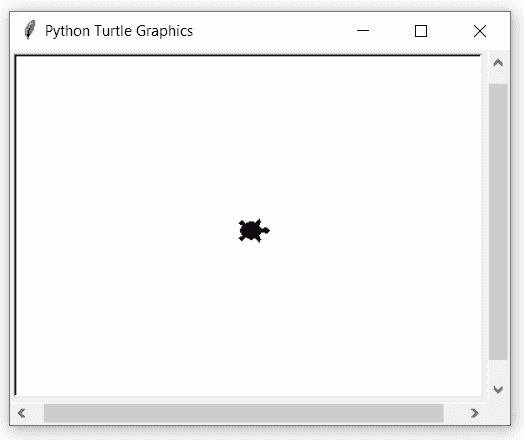
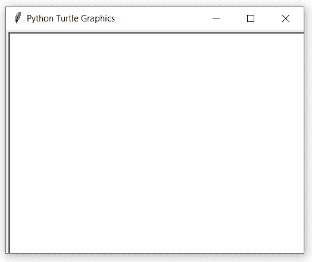

# Python 中的 turtle.shearfactor()函数

> 原文:[https://www . geesforgeks . org/turtle-shear factor-function-in-python/](https://www.geeksforgeeks.org/turtle-shearfactor-function-in-python/)

海龟模块以面向对象和面向过程的方式提供海龟图形原语。因为它使用 Tkinter 作为底层图形，所以它需要安装一个支持 Tk 的 Python 版本。

## turtle.shearfactor()

该函数用于设置或返回当前剪切因子。它根据给定的剪切系数剪切高领衫，剪切系数是剪切角的正切。

> **语法:**turtle . shear factor(shear = None)
> 
> **参数:**
> 
> **剪力(可选):**数值，剪力角的正切值。

下面是上述方法的实现，并附有一些例子:

**例 1 :**

## 蟒蛇 3

```
# importing package
import turtle

# set turtle
turtle.speed(1)
turtle.shape("turtle")
turtle.up()
turtle.goto(-150,0)
turtle.down()

# forward turtle by 100
turtle.forward(100)

# set shear by +ive value
turtle.shearfactor(0.2)

# forward turtle by 100
turtle.forward(100)

# set shear by -ive value
turtle.shearfactor(-0.2)

# forward turtle by 100
turtle.forward(100)
```

**输出:**



#### **例 2 :**

## 蟒蛇 3

```
# importing package
import turtle

# set turtle 
turtle.speed(1)
turtle.up()
turtle.goto(-40,40)
turtle.down()

# set shear and apply to
# all shapes
turtle.shearfactor(0.5)

# get shape
sh=turtle.getshapes()

# loop for pattern
for i in range(len(sh)):
    turtle.shape(sh[i])
    turtle.forward(100+10*i)
    turtle.right(90)
    turtle.forward(100+10*i)
    turtle.right(90)
```

**输出:**

