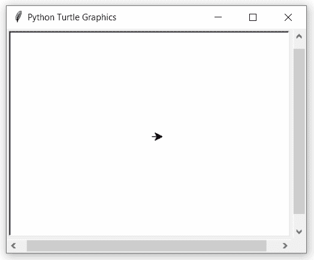

# Python 中的 turtle.showturtle()函数

> 原文:[https://www . geesforgeks . org/turtle-show turtle-python 中的函数/](https://www.geeksforgeeks.org/turtle-showturtle-function-in-python/)

海龟模块以面向对象和面向过程的方式提供海龟图形原语。因为它使用 Tkinter 作为底层图形，所以它需要安装一个支持 Tk 的 Python 版本。

## turtle.showturtle()

这个方法是用来让乌龟可见的。这不需要任何争论。

**语法:**

```
turtle.showturtle() 
or 
turtle.st()

```

下面是上述方法的一个示例实现:

**示例:**

## 蟒蛇 3

```
# import package
import turtle

# set speed to slowest for
# better understandings
turtle.speed(1)

# motion
turtle.forward(100)
turtle.right(90)

# hide the turtle
turtle.hideturtle()

# motion
turtle.forward(100)
turtle.right(90)
turtle.forward(100)
turtle.right(90)

# show the turtle
turtle.showturtle()

# motion
turtle.forward(100)
turtle.right(90)
```

**输出:**

