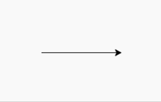
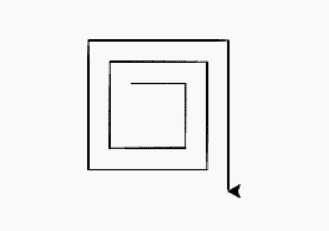

# Python 中的 turtle.speed()函数

> 原文:[https://www . geesforgeks . org/turtle-speed-function in-python/](https://www.geeksforgeeks.org/turtle-speed-function-in-python/)

海龟模块以面向对象和面向过程的方式提供海龟图形原语。因为它使用 Tkinter 作为底层图形，所以它需要安装一个支持 Tk 的 Python 版本。

## turtle.speed()

turtle.speed()方法用于根据所取参数的值来改变乌龟的速度。返回或设置海龟的速度。

**语法:**

```py
turtle.speed(speed=None)

```

**注:**

*   乌龟的速度在 0-10 之间。
*   如果输入是大于 10 或小于 0.5 的数字，速度设置为 0。
*   速度字符串通过以下方式映射到速度值:
    *   最快:0
    *   快:10
    *   正常:6
    *   慢:3
    *   最慢:1
*   速度从 1 到 10 执行越来越快的线条画和乌龟转弯动画。

下面是上述方法的实现，并附有一些例子:

**例 1 :**

## 蟒蛇 3

```py
# import package
import turtle

# slowest speed
turtle.speed(1)

# turtle movement
turtle.forward(150)
```

**输出:**



**例 2 :**

## 蟒蛇 3

```py
# import package
import turtle 

# loop for pattern
for i in range(10):

  # set turtle speed
  turtle.speed(10-i)

  # motion for pattern
  turtle.forward(50+10*i)
  turtle.right(90)
```

**输出:**

