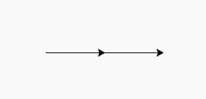
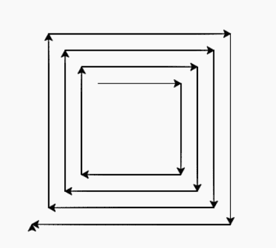

# Python 中的 turtle.stamp()函数

> 原文:[https://www . geesforgeks . org/turtle-stamp-function-in-python/](https://www.geeksforgeeks.org/turtle-stamp-function-in-python/)

海龟模块以面向对象和面向过程的方式提供海龟图形原语。因为它使用 tkinter 作为底层图形，所以需要安装一个支持 Tk 的 Python 版本。

## turtle.stamp()

这个方法用于在画布上标记一个套头衫的副本并返回它的 id。这不需要任何争论。不管乌龟的形状是什么，它都会在那个点被打印出来，并继续下一个指示。

```py
turtle.stamp()
```

下面是上述方法的实现，并附有一些例子:

**例 1:**

## 蟒蛇 3

```py
# import package
import turtle

# forward turtle by 100
turtle.forward(100)

# print the turtle shape
turtle.stamp()

# and then continue
# forward turtle by 100
turtle.forward(100)
```

**输出:**



这里中间的一个箭头是由于邮票，下一个是乌龟的头

**例 2:**

## 蟒蛇 3

```py
# import package
import turtle

# loop for printing some stamps
for i in range(15):

    # for motion
    turtle.forward(100+10*i)

    # printing turtle shape
    turtle.stamp()

    # for pattern
    turtle.right(90)
```

**输出:**



在每一个动作中打印海龟的形状