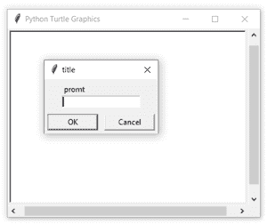
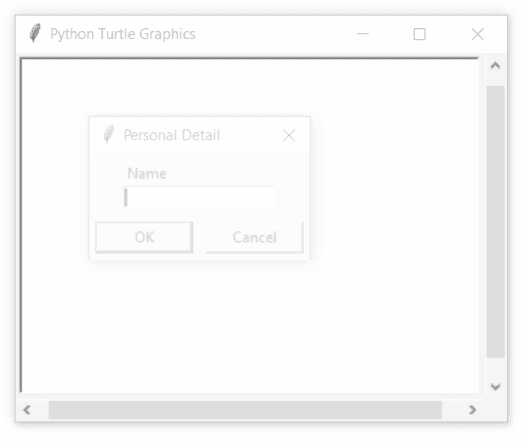

# Python 中的 turtle.textinput()函数

> 原文:[https://www . geesforgeks . org/turtle-textinput-function-in-python/](https://www.geeksforgeeks.org/turtle-textinput-function-in-python/)

海龟模块以面向对象和面向过程的方式提供海龟图形原语。因为它使用 Tkinter 作为底层图形，所以它需要安装一个支持 Tk 的 Python 版本。

## 海龟. numinput()

该函数用于弹出一个对话框，输入一个字符串。返回字符串输入。如果对话框被取消，则返回无。

**语法:**

```py
turtle.textinput(title, prompt)
```

**参数:**

<figure class="table">

| **论据** | **描述** |
| 标题 | 对话窗口的标题 |
| 提示 | 主要描述输入什么数字信息的文本 |

</figure>

下面是上述方法的实现，并附有一些例子:

**例 1 :**

## 蟒蛇 3

```py
# import package
import turtle

sc = turtle.Screen()
sc.setup(400, 300)
turtle.textinput("title", "prompt")
```

**输出:**



**例 2 :**

## 蟒蛇 3

```py
# import package
import turtle

# taking input
name = turtle.textinput("Personal Detail", "Name")

# print name input
print(name)
```

**输出:**



```py
Deepanshu Rustagi
```