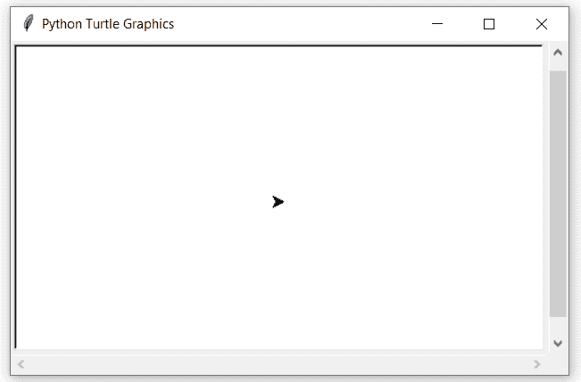
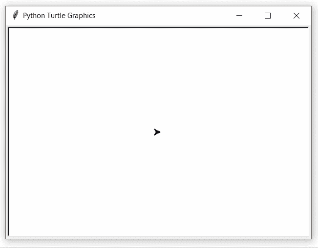

# Python 中的 turtle.tilt()函数

> 原文:[https://www . geesforgeks . org/turtle-tilt-function-in-python/](https://www.geeksforgeeks.org/turtle-tilt-function-in-python/)

海龟模块以面向对象和面向过程的方式提供海龟图形原语。因为它使用 tkinter 作为底层图形，所以需要安装一个支持 Tk 的 Python 版本。

## turtle.tilt()

该功能用于将[高领衫](https://www.geeksforgeeks.org/turtle-shape-function-in-python/)从当前倾斜角度旋转一个角度，但不改变海龟的航向(运动方向)。

**语法:**

```py
turtle.tilt(angle)

```

下面是上述方法的实现，并附有一些例子:

**例 1 :**

## 蟒蛇 3

```py
# import package
import turtle

# set turtle screen
sc=turtle.Screen()
sc.setup(500,300)

# set turtle
turtle.speed(1)
turtle.up()
turtle.setpos(-200,0)
turtle.down()
turtle.shape("square")
turtle.width(2)

# motion
turtle.forward(200)

# tilt turtleshape by 45
turtle.tilt(45)

# motion
turtle.forward(200)
```

**输出:**



**例 2 :**

## 蟒蛇 3

```py
# import package
import turtle

# set screen
sc=turtle.Screen()
sc.setup(500,350)

# set turtle
turtle.speed(1)
turtle.up()
turtle.setpos(-50,100)
turtle.down()
turtle.shape("turtle")
turtle.width(2)

# loop for pattern
for i in range(6):

    # motion
    turtle.forward(100)

    # tilt turtleshpae by 180
    turtle.tilt(180)

    # print turtleshape
    turtle.stamp()

    # move to right by 60
    turtle.right(60)

# hide the turtle
turtle.ht()
```

**输出:**

