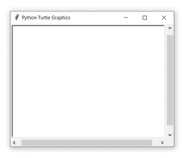

# Python 中的 turtle.title()函数

> 原文:[https://www . geesforgeks . org/turtle-title-function-in-python/](https://www.geeksforgeeks.org/turtle-title-function-in-python/)

海龟模块以面向对象和面向过程的方式提供海龟图形原语。因为它使用 Tkinter 作为底层图形，所以它需要安装一个支持 Tk 的 Python 版本。

## 海龟. title()

该功能用于设置龟窗的标题。它只需要一个参数作为“titlestring”字符串，就可以出现在海龟图形窗口的标题栏中。换句话说，它是一个显示海龟窗口标题的字符串。默认情况下，海龟图形窗口的标题是“Python 海龟图形”。

**语法:**

```py
turtle.title()

```

下面是上述方法的实现，并附有一些例子:

**例 1 :**

## 蟒蛇 3

```py
# import package
import turtle

# make turtle object 
# and set size
sc = turtle.Screen()
sc.setup(400,300)
```

**输出:**



**例 2 :**

## 蟒蛇 3

```py
# import package
import turtle

# make turtle object 
# and set size
sc = turtle.Screen()
sc.setup(400,300)

# set turtle screen title
turtle.title("Turtle Window For GFG")
```

**输出:**

