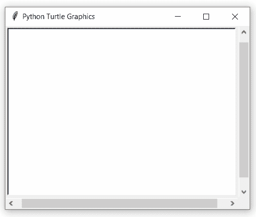

# Python 中的 turtle.tracer()函数

> 原文:[https://www . geesforgeks . org/turtle-tracer-function-in-python/](https://www.geeksforgeeks.org/turtle-tracer-function-in-python/)

海龟模块以面向对象和面向过程的方式提供海龟图形原语。因为它使用 Tkinter 作为底层图形，所以它需要安装一个支持 Tk 的 Python 版本。

## turtle.tracer()

此功能用于打开或关闭海龟动画，并设置更新绘图的延迟。

> **语法:**turtle . tracer(n =无，延迟=无)
> 
> **参数:**
> 
> *   **n:** 如果给定 n，则只真正执行每第 n 次常规屏幕更新。
> *   **延迟:**设置延迟值

下面是上述方法的实现，并附有一些例子:

**例 1 :**

## 蟒蛇 3

```py
# importing package
import turtle

# check default value
print(turtle.tracer())
```

**输出:**

```py
1

```

**例 2 :**

## 蟒蛇 3

```py
# importing package
import turtle

# loop for motion with
# default tracer as 1
for i in range(20):
    turtle.forward(1+1*i)
    turtle.right(45)

# set tracer values as (2,0)
# 2 -> for screen update
# 0 -> delay
turtle.tracer(n=2, delay=0)

# loop for motion with
# above tracer values
for i in range(20, 40):
    turtle.forward(1+1*i)
    turtle.right(45)

# set tracer values as (1,50)
# 1 -> for screen update
# 50 -> delay
turtle.tracer(n=1, delay=50)

# loop for motion with
# above tracer values
for i in range(40, 60):
    turtle.forward(1+1*i)
    turtle.right(45)
```

**输出:**

