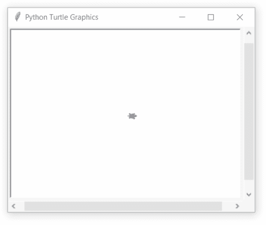
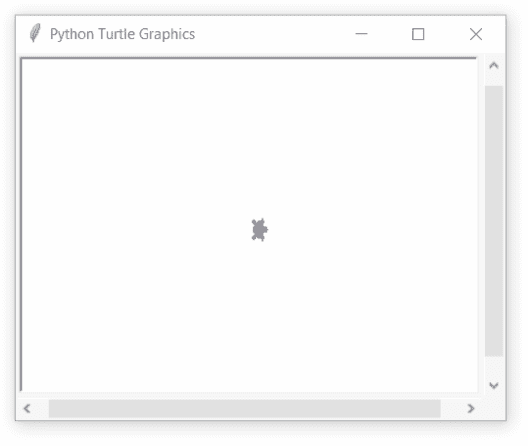
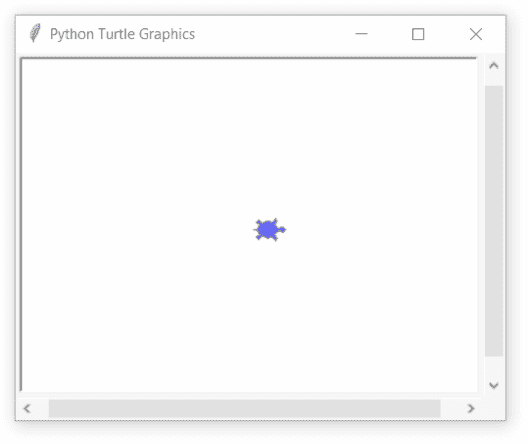
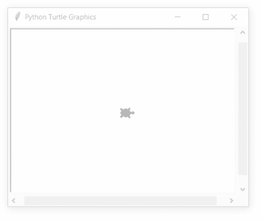

# Python 中的龟甲()函数

> 原文:[https://www . geeksforgeeks . org/turtle-turtlesize-function-in-python/](https://www.geeksforgeeks.org/turtle-turtlesize-function-in-python/)

海龟模块以面向对象和面向过程的方式提供海龟图形原语。因为它使用 Tkinter 作为底层图形，所以它需要安装一个支持 Tk 的 Python 版本。

## turtle.turtlesize()

该函数用于返回或设置笔的属性 x 或 y-拉伸因子和轮廓。

**语法:**

> 龟甲大小(拉伸 _ wid =无，拉伸 _ len =无，轮廓=无)

**参数:**

<figure class="table">

| **论据** | **值类型** | **描述** |
| 拉伸 _wid | 正数 | 垂直于方向的拉伸系数 |
| 拉伸 _ 透镜 | 正数 | 海龟方向的拉伸系数 |
| 概述 | 正数 | 确定形状轮廓的宽度 |

</figure>

下面是上述方法的实现，并附有一些例子:

**例 1 :**

## 蟒蛇 3

```
# import package
import turtle

# set turtle
turtle.speed(1)
turtle.shape("turtle")
turtle.fillcolor("blue")

# loop for motion
for i in range(4):

    # set turtle width
    turtle.turtlesize(stretch_wid=(i+1)*0.5)
    turtle.forward(100)
    turtle.right(90)
```

**输出:**



**例 2 :**

## 蟒蛇 3

```
# import package
import turtle

# set turtle
turtle.speed(1)
turtle.shape("turtle")
turtle.fillcolor("blue")

# loop for motion
for i in range(4):

    # set turtle length
    turtle.turtlesize(stretch_len=(i+1)*0.5)
    turtle.forward(100)
    turtle.right(90)
```

**输出:**



**例 3 :**

## 蟒蛇 3

```
# import package
import turtle

# set turtle
turtle.speed(1)
turtle.shape("turtle")
turtle.fillcolor("blue")

# loop for motion
for i in range(4):

    # set turtle outline
    turtle.turtlesize(outline=i+1)
    turtle.forward(100)
    turtle.right(90)
```

**输出:**



**例 4 :**

## 蟒蛇 3

```
# import package
import turtle

# set turtle
turtle.speed(1)
turtle.shape("turtle")
turtle.fillcolor("blue")

# loop for motion
for i in range(4):

    # set turtlesize properties all together
    turtle.turtlesize(stretch_wid=(i+1)*0.5,
                      stretch_len=(i+1)*0.5,
                      outline=(i+1)
                     )
    turtle.forward(100)
    turtle.right(90)
```

**输出:**

