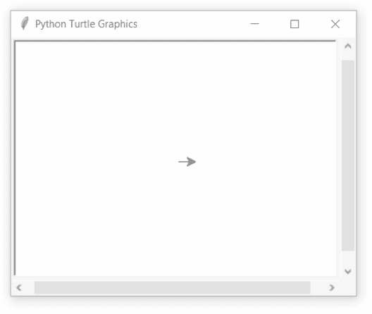
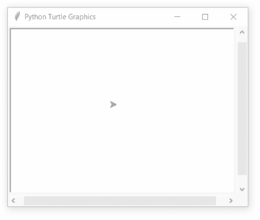

# Python 中的 turtle.undo()函数

> 原文:[https://www . geesforgeks . org/turtle-undo-function-in-python/](https://www.geeksforgeeks.org/turtle-undo-function-in-python/)

海龟模块以面向对象和面向过程的方式提供海龟图形原语。因为它使用 Tkinter 作为底层图形，所以它需要安装一个支持 Tk 的 Python 版本。

## turtle.undo()

该功能用于撤销(重复)上一次海龟动作。可用撤消操作的数量由撤消缓冲区的大小决定。这不需要任何争论。

**语法:**

```
turtle.undo()

```

下面是上述方法的实现，并附有一些例子:

**例 1 :**

## 蟒蛇 3

```
# import package
import turtle

# set speed
turtle.speed(1)

# motion
turtle.forward(100)

# undo previous motion
turtle.undo()
```

**输出:**



**例 2 :**

## 蟒蛇 3

```
# import package
import turtle

# set turtle
turtle.speed(1)
turtle.up()
turtle.setpos(-50,50)
turtle.down()

# motion
for i in range(4):
    turtle.forward(100)
    turtle.right(90)

# undo
for i in range(8):
    turtle.undo()
```

**输出:**



**例 3 :**

## 蟒蛇 3

```
# import package
import turtle

# set speed
turtle.speed(1)

# loop for motion
for i in range(4):

    # motion
    turtle.forward(100)

    # undo previous work
    turtle.undo()

    # turn
    turtle.left(90)
```

**输出:**

