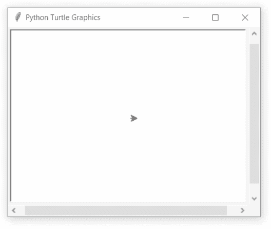

# Python 中的 turtle.undobufferentries()函数

> 原文:[https://www . geeksforgeeks . org/turtle-undofferentries-function-in-python/](https://www.geeksforgeeks.org/turtle-undobufferentries-function-in-python/)

海龟模块以面向对象和面向过程的方式提供海龟图形原语。因为它使用 Tkinter 作为底层图形，所以它需要安装一个支持 Tk 的 Python 版本。

## turtle.undobufferentries()

该函数用于返回 undobuffer 中的条目数。这不需要任何争论。

**语法:**

```py
turtle.undobufferentries()

```

下面是上述方法的实现，并附有一些例子:

**例 1 :**

## 蟒蛇 3

```py
# import package
import turtle

# loop for motion
for i in range(50):
    turtle.forward(20+2*i)
    turtle.right(90)

# check the undo buffer size
# it is loop iteration*turtle's statement
# i.e; 50*2 = 100
print(turtle.undobufferentries())
```

**输出:**

```py
100

```

**例 2 :**

## 蟒蛇 3

```py
# import package
import turtle

# loop for motion
for i in range(50):
    turtle.forward(20+2*i)
    turtle.right(90)

# call undo() method till the 
# undobuffer length
while turtle.undobufferentries():
    turtle.undo()
```

**输出:**

