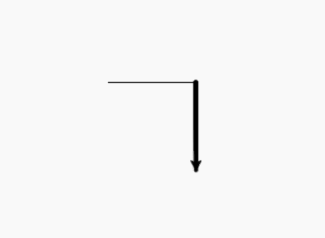
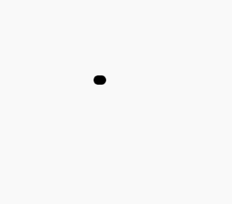

# Python 中的 turtle.width()函数

> 原文:[https://www . geesforgeks . org/turtle-width-function-in-python/](https://www.geeksforgeeks.org/turtle-width-function-in-python/)

海龟模块以面向对象和面向过程的方式提供海龟图形原语。因为它使用 Tkinter 作为底层图形，所以它需要安装一个支持 Tk 的 Python 版本。

## turtle.width()

此方法用于设置或返回线宽。将线条粗细设置为宽度或返回宽度。如果将 resizemode 设置为“自动”，并且 turtleshape 是一个多边形，则该多边形将以相同的线条粗细绘制。如果没有给定参数，则返回当前的 pensize。

**语法:**

```
turtle.width(width=None)
turtle.pensize(width=None)

```

**注意:**这个方法有别名:pensize 和 width，只需要一个参数“width —正数”。

下面是上述方法的实现，并附有一些例子:

**例 1 :**

## 蟒蛇 3

```
# import package
import turtle 

# forward turtle by 100
turtle.forward(100)

# set turtle width to 4
turtle.width(4)

# forward turtle by 100
# in right direction
turtle.right(90)
turtle.forward(100)
```

**输出:**



**例 2 :**

## 蟒蛇 3

```
# import package
import turtle 

# loop for pattern
for i in range(15):

  # set turtle width
  turtle.width(15-i)

  # motion for pattern
  turtle.forward(50+15*i)
  turtle.right(90)
```

**输出:**



在上面的例子中，我们在每次移动时都减小乌龟的尺寸，这样外部线条的尺寸就小于内部线条的尺寸。