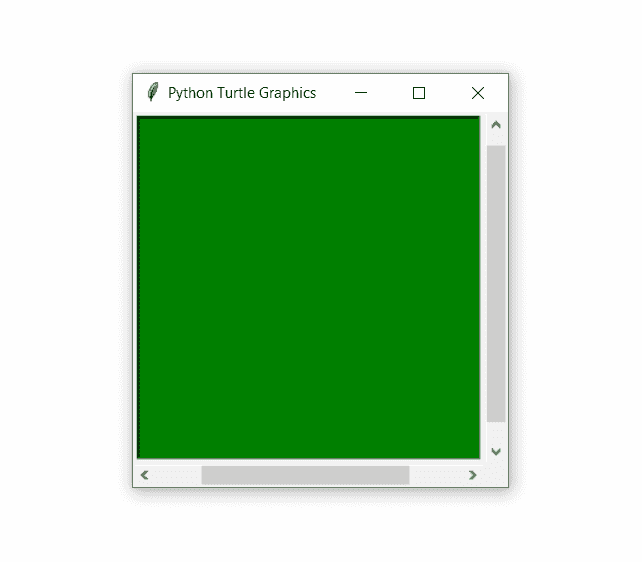

# Python 中的 turtle.window_width()函数

> 原文:[https://www . geesforgeks . org/turtle-window _ width-function-in-python/](https://www.geeksforgeeks.org/turtle-window_width-function-in-python/)

海龟模块以面向对象和面向过程的方式提供海龟图形原语。因为它使用 Tkinter 作为底层图形，所以它需要安装一个支持 Tk 的 Python 版本。

## turtle.window_width()

这个函数用来返回乌龟窗口的宽度。这不需要任何争论。

**语法:**

```
turtle.window_width()

```

下面是上述方法的一个示例实现:

## 蟒蛇 3

```
# import package
import turtle

# get turtle window width
print(turtle.window_width())

# make screen object
# then set size and color
sc = turtle.Screen()
sc.setup(300,300)
sc.bgcolor("green")

# get turtle window width
print(turtle.window_width())

# loops for pass time
for i in range(5000):
  for j in range(5000):
    pass

# set size and color again
sc.setup(500,400)
sc.bgcolor("red")

# get turtle window width
print(turtle.window_width())
```

**输出:**



```
768
300
500
```