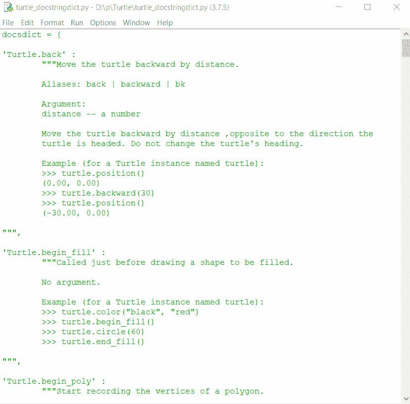

# Python 中的 turtle.write _ docstringdict()函数

> 原文:[https://www . geesforgeks . org/turtle-write _ docstringdict-function-in-python/](https://www.geeksforgeeks.org/turtle-write_docstringdict-function-in-python/)

海龟模块以面向对象和面向过程的方式提供海龟图形原语。因为它使用 Tkinter 作为底层图形，所以它需要安装一个支持 Tk 的 Python 版本。

## turtle.write_docstringdict()

此方法用于创建文档字符串字典并将其写入文件。

**语法:**

```py
turtle.write_docstringdict(filename='turtle_docstringdict')

```

必须显式调用(海龟图形类不使用)。文档字符串字典将被写入 Python 脚本 <filename>.py。它旨在作为将文档字符串翻译成不同语言的模板。</filename>

下面是上述方法的一个示例实现:

## 蟒蛇 3

```py
# importing package
import turtle

# making docstringdictionary file
turtle.write_docstringdict(filename='turtle_docstringdict')
```

**输出:**



在这里，我们可以看到一个名为“turtle_docstringdict.py”的输出文件，其中存储了 turtle 方法的描述和示例。所有内容都以字典(键值对)的形式存储，其中:

*   **键:**方法名
*   **值:**举例说明