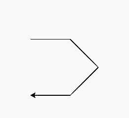

# Python 中的 turtle.ycor()函数

> 原文:[https://www . geesforgeks . org/turtle-y cor-function-in-python/](https://www.geeksforgeeks.org/turtle-ycor-function-in-python/)

海龟模块以面向对象和面向过程的方式提供海龟图形原语。因为它使用 Tkinter 作为底层图形，所以它需要安装一个支持 Tk 的 Python 版本。

## turtle.ycor()

该函数用于返回海龟当前位置的海龟 y 坐标。这不需要任何争论。

**语法:**

```py
turtle.ycor()

```

下面是上述方法的一个示例实现:

**示例:**

## 蟒蛇 3

```py
# import package
import turtle

# check y coordinate
print(turtle.ycor())
turtle.forward(100)

# check y coordinate
print(turtle.ycor())
turtle.right(45)
turtle.forward(100)

# check y coordinate
print(turtle.ycor())
turtle.right(90)
turtle.forward(100)

# check y coordinate
print(turtle.ycor())
turtle.right(45)
turtle.forward(100)

# check y coordinate
print(turtle.ycor())
```

**输出:**



```py
0.0
0.0
-70.7106781187
-141.421356237
-141.421356237

```