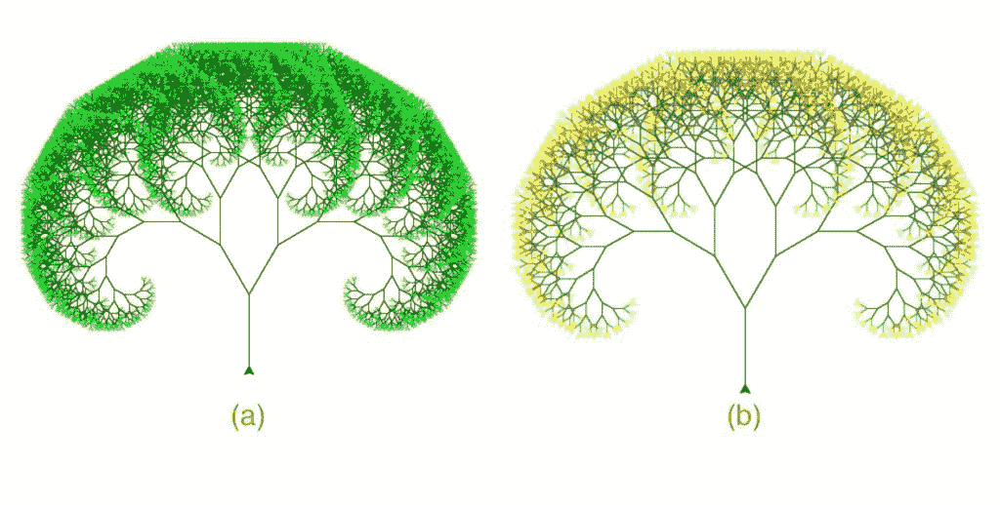

# 使用海龟的 Python 中的 Y 分形树

> 原文:[https://www . geeksforgeeks . org/y-分形-python 中的树-使用-海龟/](https://www.geeksforgeeks.org/y-fractal-tree-in-python-using-turtle/)

分形是一种永无止境的模式。分形是无限复杂的模式，在不同的尺度上是自相似的。它们是通过在一个持续的反馈循环中一遍又一遍地重复一个简单的过程而产生的。在递归的驱动下，分形是动态系统的图像——混沌的图像。

在本文中，我们将使用 Python 中的递归技术绘制一个彩色的 Y 分形树。

**例:**

[](https://media.geeksforgeeks.org/wp-content/uploads/20200525205829/trees.jpg)

深度级别的输出:(a) 14 (b) 12

### 所需模块

**海龟:** *海龟*库使用户能够使用命令绘制图片或形状，为他们提供了一个虚拟画布。*龟*自带 Python 的标准库。它需要一个支持 *Tk* 的 Python 版本，因为它使用*Tinter*作为图形。

**使用的功能:**

*   *fd(x)* :将光标前移 *x* 像素。
*   *rt(x)，lt(x)* :将光标的朝向分别向右和向左旋转 *x* 度。
*   *colormode()* :将颜色模式改为 rgb。
*   *铅笔颜色(r，g，b)* :设置龟笔的颜色。
*   *速度()*:设定乌龟的速度。

**接近**:

*   我们首先为基础(1 级)树绘制一个单一的“Y”形。然后“Y”的两个分支作为另外两个“Y”的基础(第 2 级)。
*   这个过程递归重复，Y 的大小随着级别的增加而减小。
*   树的着色是逐级完成的:从底层最暗到顶层最亮。

在下面的实现中，我们将绘制一棵大小为 **80** 的树，并对 **7** 进行调平。

```
from turtle import *

speed('fastest')

# turning the turtle to face upwards
rt(-90)

# the acute angle between
# the base and branch of the Y
angle = 30

# function to plot a Y
def y(sz, level):   

    if level > 0:
        colormode(255)

        # splitting the rgb range for green
        # into equal intervals for each level
        # setting the colour according
        # to the current level
        pencolor(0, 255//level, 0)

        # drawing the base
        fd(sz)

        rt(angle)

        # recursive call for
        # the right subtree
        y(0.8 * sz, level-1)

        pencolor(0, 255//level, 0)

        lt( 2 * angle )

        # recursive call for
        # the left subtree
        y(0.8 * sz, level-1)

        pencolor(0, 255//level, 0)

        rt(angle)
        fd(-sz)

# tree of size 80 and level 7
y(80, 7)
```

**输出:**

<video class="wp-video-shortcode" id="video-419022-1" width="665" height="394" preload="metadata" controls=""><source type="video/mp4" src="https://media.geeksforgeeks.org/wp-content/uploads/20200526150424/Screen-Recording-2020-05-26-at-2.58.22-PM.mp4?_=1">[https://media.geeksforgeeks.org/wp-content/uploads/20200526150424/Screen-Recording-2020-05-26-at-2.58.22-PM.mp4](https://media.geeksforgeeks.org/wp-content/uploads/20200526150424/Screen-Recording-2020-05-26-at-2.58.22-PM.mp4)</video>