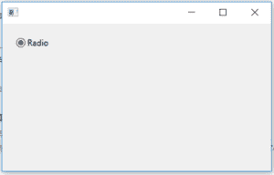

# 使用 wxPython

在框架中创建单选按钮

> 原文:[https://www . geesforgeks . org/create-radio button-in-frame-use-wxpython/](https://www.geeksforgeeks.org/create-radiobutton-in-frame-using-wxpython/)

在本文中，我们将学习 wxPython 中的单选按钮。单选按钮项目是通常表示几个互斥选项之一的按钮。
它在一个(通常)圆形按钮旁边有一个文本标签。
通过为组中的第一个按钮指定 RB_GROUP，可以创建一组互斥的单选按钮。当创建另一个单选按钮组或不再有单选按钮时，该组结束。

> **语法:**
> wx。RadioButton.RadioButton(父级，id = ID_ANY，label = "，pos = DefaultPosition，
> size = DefaultSize，style = 0，validator = DefaultValidator，
> name = RadioButtonNameStr)
> 
> **参数:**
> 
> | 参数 | 输入类型 | 描述 |
> | --- | --- | --- |
> | 父母 | wx。窗户 | 父窗口。不应该是无。 |
> | 身份证明（identification） | wx.窗口标识 | 控件标识符。值-1 表示默认值。 |
> | 标签 | 线 | 标示文字。 |
> | 刷卡机 | wx。要点 | 窗口位置。 |
> | 大小 | wx。窗户 | 窗口大小。 |
> | 风格 | 长的 | 窗口样式。 |
> | 验证器 | wx。验证器 | 窗口验证器。 |
> | 名字 | 线 | 窗口名称。 |

**代码示例:**

```py
# importing the module
import wx

# definition of the Example class
class Example(wx.Frame):

    # instantiating the class     
    def __init__(self, *args, **kwargs):
        super(Example, self).__init__(*args, **kwargs)

        self.InitUI()

    # method for creation of user interface
    def InitUI(self):

        # create parent panel for radio buttons
        self.pnl = wx.Panel(self)

        # create radio button using RadioButton() constructor
        self.rb = wx.RadioButton(self.pnl, id = 1, label ="Radio", pos =(20, 20))

# definition of the main function
def main():

    # creating an App object
    app = wx.App()

    # creating an Example object
    ex = Example(None)

    # showing the Example object
    ex.Show()

    # running the App object
    app.MainLoop()

# driver code
if __name__ == '__main__':
    main()
```

**输出窗口:**
