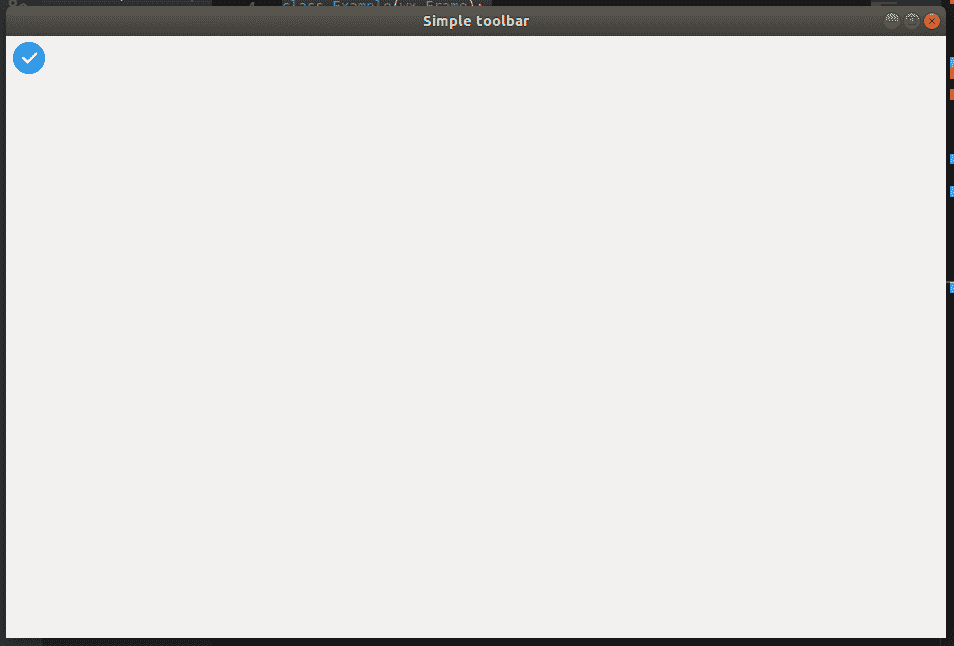
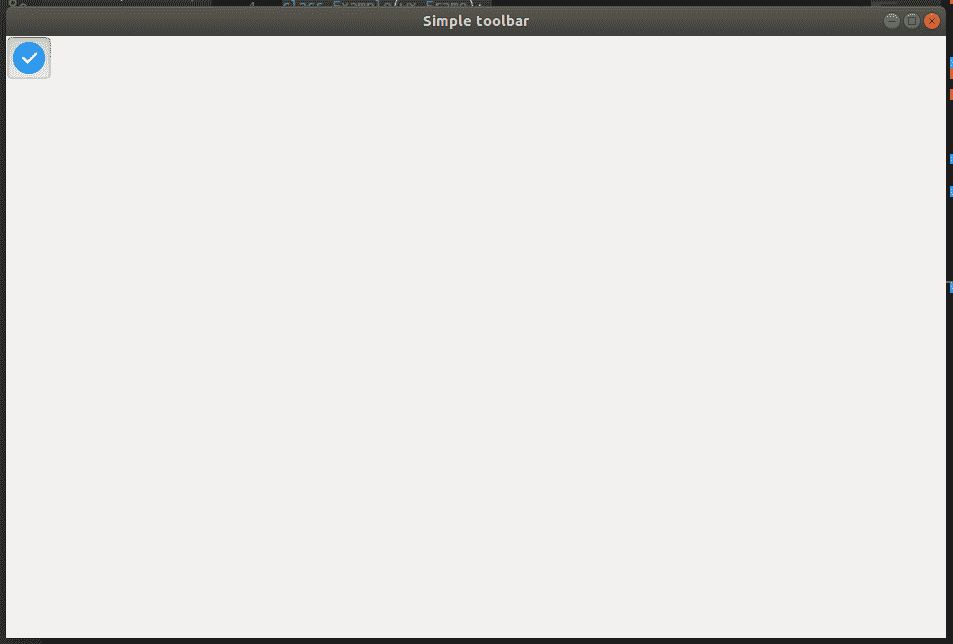

# Python–wxPython 中的 AddCheckTool()函数

> 原文:[https://www . geesforgeks . org/python-addchecktool-function-in-wxpython/](https://www.geeksforgeeks.org/python-addchecktool-function-in-wxpython/)

在本文中，我们将学习 wx 中的 AddCheckTool()。wxPython 的工具栏类。AddCheckTool()函数用于添加检查工具。checktool 是一种切换按钮。检查工具具有开和关状态。

> **语法:** wx。ToolBar.AddCheckTool(self，toolId，label，bitmap1，bmpDisabled=NullBitmap，shortHelp= "，longHelp= "，clientData=None)
> 
> **参数:**
> 
> | 参数 | 输入类型 | 描述 |
> | --- | --- | --- |
> | 椅子 | （同 Internationalorganizations）国际组织 | 一个整数，通过它可以在后续操作中识别工具。 |
> | 标签 | 线 | 工具要显示的字符串。 |
> | 位图 1 | wx .位图 | 主要工具位图。 |
> | bmpDisabled | wx .位图 | 工具禁用时使用的位图。 |
> | 简短的帮助 | 线 | 该字符串用于工具提示。 |
> | longHelp | 线 | 与工具关联的详细字符串。 |
> | clientdate | 普塞达塔 | 一个指向客户端数据的可选指针，稍后可以使用 GetToolClientData 检索该指针。 |
> 
> **返回类型:** wx。工具栏工具库

**代码示例:**

```py
import wx

class Example(wx.Frame):
    global count
    count = 0;
    def __init__(self, *args, **kwargs):
        super(Example, self).__init__(*args, **kwargs)

        self.InitUI()

    def InitUI(self):
        pnl = wx.Panel(self)
        self.toolbar = self.CreateToolBar()

        # create check toolusing AddCheckTool() function
        rtool = self.toolbar.AddCheckTool(12, 'CheckTool', 
                   bitmap1 = wx.Bitmap('/Desktop/wxPython/right.png'), 
                   bmpDisabled = wx.Bitmap('/Desktop/wxPython/wrong.png'))

        self.toolbar.Realize()

        self.SetSize((350, 250))
        self.SetTitle('Simple toolbar')
        self.Centre()

def main():

    app = wx.App()
    ex = Example(None)
    ex.Show()
    app.MainLoop()

if __name__ == '__main__':
    main()
```

**输出:**
*未勾选:*


*勾选:*
