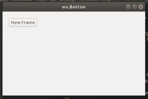

# Python–wxPython 中的 Create()函数

> 原文:[https://www . geesforgeks . org/python-create-function-in-wxpython/](https://www.geeksforgeeks.org/python-create-function-in-wxpython/)

在这篇特别的文章中，我们将学习 wx 中的 Create()函数。框架类。Create 函数类似于 wx 的 Frame()构造函数。框架类。创建功能用于两步框架构造。

> **语法:**
> 
> ```py
> wx.Frame.Create(parent, id=ID_ANY, title="", pos=DefaultPosition,
>       size=DefaultSize, style=DEFAULT_FRAME_STYLE, name=FrameNameStr)
> 
> ```
> 
> **参数:**
> 
> | 参数 | 输入类型 | 描述 |
> | --- | --- | --- |
> | 父母 | wx。窗户 | 父窗口。不应该是无。 |
> | 身份证明（identification） | wx.窗口标识 | 控件标识符。值-1 表示默认值。 |
> | 标题 | 线 | 框架的标题。 |
> | 刷卡机 | wx。要点 | 窗口位置。 |
> | 大小 | wx。窗户 | 窗口大小。 |
> | 风格 | 长的 | 窗口样式。 |
> | 名字 | 线 | 窗口名称。 |

**代码示例:**

```py
# import wxPython
import wx

class Example(wx.Frame):

    def __init__(self, *args, **kw):
        super(Example, self).__init__(*args, **kw)

        self.InitUI()

    def InitUI(self):

        pnl = wx.Panel(self)
        Button = wx.Button(pnl, label ='New Frame', pos =(20, 20))

        Button.Bind(wx.EVT_BUTTON, self.OnNewFrame)

        self.SetSize((350, 250))
        self.SetTitle('wx.Button')

    def OnNewFrame(self, e):
        app = wx.App()
        frm = wx.Frame()
        frm.Create(None, title ="Frame using Create()")
        frm.Show()
        app.MainLoop()

def main():
    app = wx.App()
    ex = Example(None)
    ex.Show()
    app.MainLoop()

if __name__ == '__main__':
    main()  
```

**输出:**

**点击【新建帧】按钮前:**


**点击【新建帧】按钮后:**
