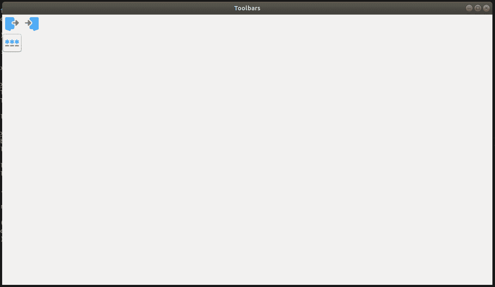

# Python–在 wxPython 中创建多个工具栏

> 原文:[https://www . geesforgeks . org/python-create-multi-toolbarks-in-wxpython/](https://www.geeksforgeeks.org/python-create-multiple-toolbars-in-wxpython/)

我们在上一篇文章中创建了一个工具栏，现在我们将学习如何在 wxPython 中创建多个工具栏。因此，我们将创建两个工具栏，并为它们都添加工具。

> **步骤:**
> **1。**创建一个垂直分级机。
> **2。**创建第一个工具栏。
> **3。**将工具添加到第一个工具栏。
> **2。**创建第二个工具栏。
> **3。**将工具添加到第二个工具栏。
> **4。**将工具栏与尺寸器相关联。

**代码示例:**
创建两个工具栏

## 蟒蛇 3

```
import wx

class Example(wx.Frame):

    def __init__(self, *args, **kwargs):
        super(Example, self).__init__(*args, **kwargs)

        self.InitUI()

    def InitUI(self):

        vbox = wx.BoxSizer(wx.VERTICAL)

        toolbar1 = wx.ToolBar(self)
        toolbar1.AddTool(wx.ID_ANY, '', wx.Bitmap('/Desktop/wxPython/signs.png'))
        toolbar1.AddTool(wx.ID_ANY, '', wx.Bitmap('/Desktop/wxPython/login.png'))

        toolbar1.Realize()

        toolbar2 = wx.ToolBar(self)
        qtool = toolbar2.AddTool(wx.ID_EXIT, '', wx.Bitmap('/Desktop/wxPython/password.png'))
        toolbar2.Realize()

        vbox.Add(toolbar1, 0, wx.EXPAND)
        vbox.Add(toolbar2, 0, wx.EXPAND)

        self.Bind(wx.EVT_TOOL, self.OnQuit, qtool)

        self.SetSizer(vbox)

        self.SetSize((600, 4000))
        self.SetTitle('Multiple Toolbars')
        self.Centre()

    def OnQuit(self, e):
        self.Close()

def main():

    app = wx.App()
    ex = Example(None)
    ex.Show()
    app.MainLoop()

if __name__ == '__main__':
    main()
```

**输出:**

