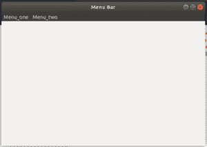

# Python–wxPython 中的 GetMenu()函数

> 原文:[https://www . geesforgeks . org/python-get menu-function-in-wxpython/](https://www.geeksforgeeks.org/python-getmenu-function-in-wxpython/)

在这篇特别的文章中，我们将学习 wx 的 GetMenu()函数。wxPython 的菜单栏类。GetMenu()是 wx 中的函数。返回 wx 的菜单栏类。菜单栏中显示的菜单对象。它只需要菜单栏上的菜单索引。

> **语法:**
> 
> ```py
> wx.MenuBar.GetMenu(self, menuindex)
> 
> ```
> 
> **参数:**
> 
> | 参数 | 输入类型 | 描述 |
> | --- | --- | --- |
> | menu index-功能表索引 | （同 Internationalorganizations）国际组织 | 菜单栏中菜单的位置 |
> 
> **返回:**返回菜单菜单(从零开始)。

**代码示例:**

```py
import wx

class Example(wx.Frame):

    def __init__(self, *args, **kw):
        super(Example, self).__init__(*args, **kw)

        # create MenuBar using MenuBar() function
        menubar = wx.MenuBar()

        # add menu to MenuBar
        fm1 = wx.Menu()
        fileitem = fm1.Append(20, "one")

        fm2 = wx.Menu()
        fileitem2 = fm2.Append(21, "two")
        menubar.Append(fm1, '&Menu_one')
        menubar.Append(fm2, '&Menu_two')
        self.SetMenuBar(menubar)
        self.SetSize((300, 200))
        self.SetTitle('Menu Bar')

        # print returned menu object
        print(menubar.GetMenu(1))

def main():
    app = wx.App()
    ex = Example(None)
    ex.Show()
    app.MainLoop()

if __name__ == '__main__':
    main()
```

**输出**


**命令行输出:**

```py
<wx._core.Menu object at 0x7fa64ba65318>

```