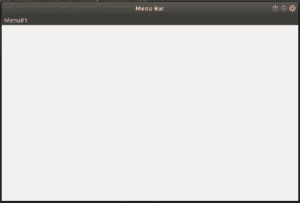

# Python–wxPython 中的菜单栏

> 原文:[https://www.geeksforgeeks.org/python-menubars-in-wxpython/](https://www.geeksforgeeks.org/python-menubars-in-wxpython/)

图形用户界面中最重要的部分之一是菜单栏，用于在窗口上执行各种操作。在本文中，我们将学习如何创建一个菜单栏并向其中添加菜单项。这可以使用 wx 中的 MenuBar()构造函数和 Append()函数来实现。菜单栏类。

> **菜单栏()构造函数的语法:**
> 
> ```
> wx.MenuBar(style=0)
> 
> ```
> 
> **Append()函数的语法:**
> 
> ```
> wx.MenuBar.Append(self, menu, title)
> 
> ```
> 
> **参数:**
> 
> | 参数 | 输入类型 | 描述 |
> | --- | --- | --- |
> | 菜单 | wx 菜单 | 要添加的菜单。调用追加后不要取消分配此菜单。 |
> | 标题 | 线 | 菜单的标题必须是非空的。 |

**代码示例:**

```
# import wxPython 
import wx

class Example(wx.Frame):

    def __init__(self, *args, **kwargs):
        super(Example, self).__init__(*args, **kwargs)

        self.InitUI()

    def InitUI(self):
        # create MenuBar using MenuBar() function
        menubar = wx.MenuBar()
        fileMenu = wx.Menu()
        # add menu to MenuBar
        menubar.Append(fileMenu, '&Menu# 1')
        self.SetMenuBar(menubar)

        self.SetSize((300, 200))
        self.SetTitle('Menu Bar')
def main():

    app = wx.App()
    ex = Example(None)
    ex.Show()
    app.MainLoop()

if __name__ == '__main__':
    main()
```

**输出:**
