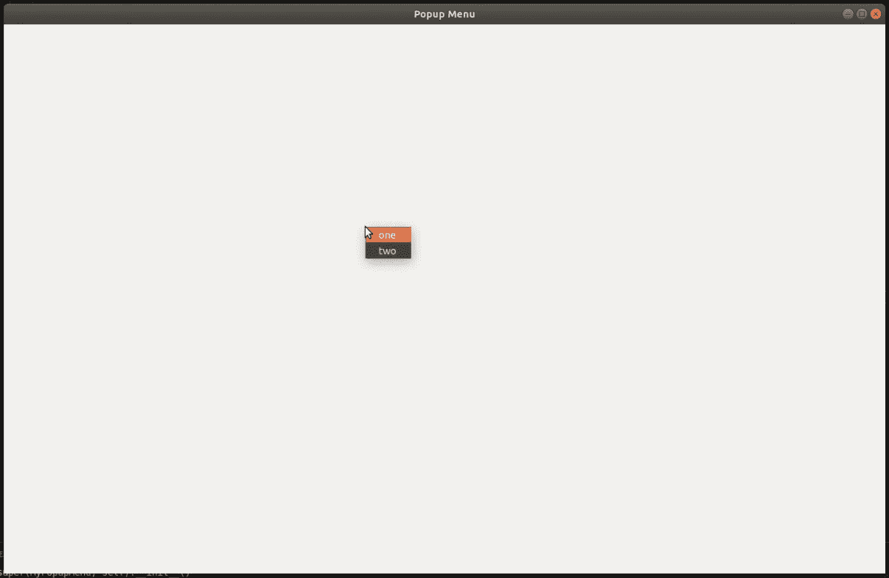

# Python–Wxpython 中的弹出菜单

> 原文:[https://www . geesforgeks . org/python-popup-menu-in-wxpython/](https://www.geeksforgeeks.org/python-popup-menu-in-wxpython/)

在本文中，我们将了解如何在 wxPython 中创建一个弹出窗口。我们将编写一个代码，当我们在屏幕上点击右键时，会出现一个弹出菜单，菜单项名称为“一”和“二”。

> **语法:**
> 
> ```
> wx.Window.PopupMenu(self, menu, pos)
> 
> ```
> 
> **参数:**
> 
> | 参数 | 输入类型 | 描述 |
> | --- | --- | --- |
> | 菜单 | wx 菜单 | 弹出菜单中的菜单。 |
> | 要点 | wx。要点 | 弹出菜单的点。 |

**代码示例:**

```
import wx

class PopMenu(wx.Menu):

    def __init__(self, parent):
        super(PopMenu, self).__init__()

        self.parent = parent

        # menu item 1
        popmenu = wx.MenuItem(self, wx.NewId(), 'one ')
        self.Append(popmenu)
        # menu item 2
        popmenu2 = wx.MenuItem(self, wx.NewId(), 'two')
        self.Append(popmenu2)

class Example(wx.Frame):

    def __init__(self, *args, **kwargs):
        super(Example, self).__init__(*args, **kwargs)

        self.InitUI()

    def InitUI(self):

        self.Bind(wx.EVT_RIGHT_DOWN, self.OnRightDown)

        self.SetSize((600, 400))
        self.SetTitle('Popup Menu')
        self.Centre()

    def OnRightDown(self, e):
        # sow popu menu
        self.PopupMenu(PopMenu(self), e.GetPosition())

def main():

    app = wx.App()
    ex = Example(None)
    ex.Show()
    app.MainLoop()

if __name__ == '__main__':
    main()
```

**输出:**
