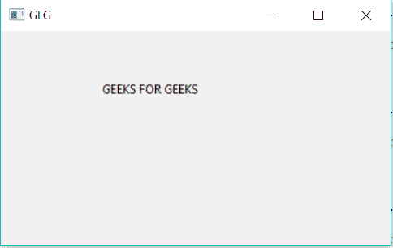
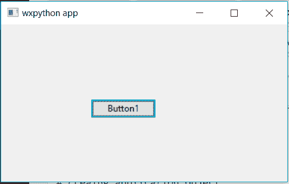
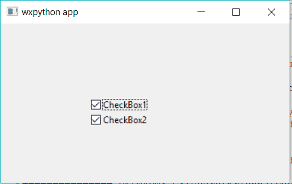
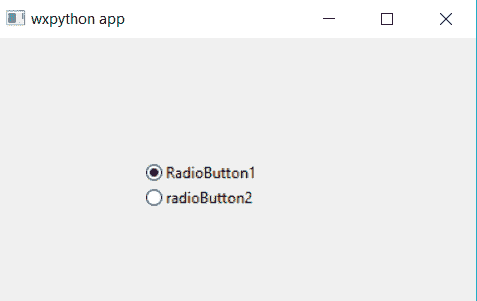

# Python | wxPython 模块介绍

> 原文:[https://www . geesforgeks . org/python-wxpython-module-introduction/](https://www.geeksforgeeks.org/python-wxpython-module-introduction/)

Python 提供 ***wxpython 模块*** ，可以让我们创建高功能的图形用户界面。这是一个开源模块，这意味着任何人都可以免费使用，源代码可供任何人查看和修改。
它被实现为一组扩展模块，包装了用 C++编写的 wxWidgets 库的 GUI 组件。它是 python 的跨平台 GUI 工具包，凤凰版凤凰是改进的下一代 wxPython，它主要关注速度、维护能力和可扩展性。
**使用此命令安装:**

```
pip install wxpython
```

**使用 wxpython 创建 GUI:**

1.  首先导入 *wx* 模块。
2.  为应用程序类创建一个对象。
3.  为框架类创建一个对象，并将其他控件添加到框架对象中，以便使用面板维护其布局。
4.  然后添加一个静态文本对象来显示你好世界。
5.  使用 Show 方法显示框架窗口。
6.  使用主事件循环应用程序对象运行应用程序，直到窗口关闭。

**示例#1:** 一个简单的图形用户界面应用程序，它使用 wxpython 为极客说*极客*。

## 蟒蛇 3

```
# import wx module
import wx

# creating application object
app1 = wx.App()

# creating a frame
frame = wx.Frame(None, title ="GFG")
pa = wx.Panel(frame)

# Adding a text to the frame object
text1 = wx.StaticText(pa, label ="GEEKS FOR GEEKS", pos =(100, 50))

# show it
frame.Show()

# start the event loop
app1.Mainloop()
```

**输出:**



**示例#2:** 使用 wx 模块
创建按钮

## 蟒蛇 3

```
# Import wx module
import wx

# creating application object
app1 = wx.App()

# creating a frame
frame = wx.Frame(None, title ="wxpython app")
pa = wx.Panel(frame)

# Button creation
e = wx.Button(pa, -1, "Button1", pos = (120, 100))

# show it
frame.Show()

# start the event loop
app1.Mainloop()
```

**输出:**



**示例#3:** 复选框使用 wxpython

## 蟒蛇 3

```
# importing wx module
import wx

# creating application object
app1 = wx.App()

# creating a frame
frame = wx.Frame(None, title ="wxpython app")
pa = wx.Panel(frame)

# Checkbox creation using wx module
e = wx.CheckBox(pa, -1, "CheckBox1", pos = (120, 100))
e = wx.CheckBox(pa, -1, "CheckBox2", pos = (120, 120))

# show it
frame.Show()

# start the event loop
app1.Mainloop()
```

**输出:**



**示例#4:** 使用 wxpython
的单选按钮

## 蟒蛇 3

```
# importing wx module
import wx

# creating application object
app1 = wx.App()

# creating a frame
frame = wx.Frame(None, title ="wxpython app")
pa = wx.Panel(frame)

# RadioButton creation using wx module
e = wx.RadioButton(pa, -1, "RadioButton1", pos = (120, 100))
e = wx.RadioButton(pa, -1, "radioButton2", pos = (120, 120))

# show it
frame.Show()

# start the event loop
app1.Mainloop()
```

**输出:**

